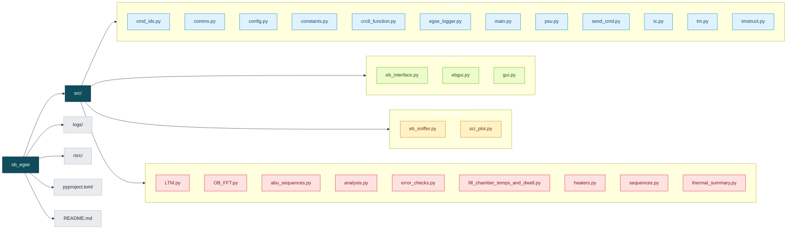
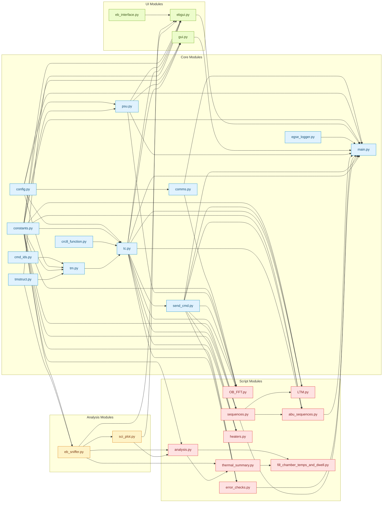

# Project Framework Overview

## Project Structure Flowchart

## Cross-Module Dependency Flowchart

Arrow direction: `A --> B` means **module `B` imports module `A`**.

## Module APIs and Method Details

### Core Modules

#### `cmd_ids`
- Path: `src/cmd_ids.py`
- Module Purpose: Utility/feature module in the EGSE stack.

**Functions**
- None

**Classes**
- None

#### `comms`
- Path: `src/comms.py`
- Module Purpose: Utility/feature module in the EGSE stack.

**Functions**
- `initialise_comms(com_port)`
  Does: Implements logic that handles initialise comms.
- `open_comms(port)`
  Does: Opens and initializes comms.
- `close_comms(port)`
  Does: Closes comms and releases related resources.

**Classes**
- None

#### `config`
- Path: `src/config.py`
- Module Purpose: Utility/feature module in the EGSE stack.

**Functions**
- None

**Classes**
- None

#### `constants`
- Path: `src/constants.py`
- Module Purpose: Utility/feature module in the EGSE stack.

**Functions**
- None

**Classes**
- None

#### `crc8_function`
- Path: `src/crc8_function.py`
- Module Purpose: Utility/feature module in the EGSE stack.

**Functions**
- `crc8Calculate(cmdInput)`
  Does: Implements logic that handles crc8 calculate.
- `crc8InjectErr(cmdInput)`
  Does: Implements logic that handles crc8 inject err.

**Classes**
- None

#### `egse_logger`
- Path: `src/egse_logger.py`
- Module Purpose: Utility/feature module in the EGSE stack.

**Functions**
- `get_loggers(basedir, prefix, debug_level)`
  Does: Returns loggers for callers that need current state or metadata.

**Classes**
- None

#### `main`
- Path: `src/main.py`
- Module Purpose: Utility/feature module in the EGSE stack.

**Functions**
- `init_arparse()`
  Does: Implements logic that handles init arparse.
- `setup_logs()`
  Does: Implements logic that handles setup logs.
- `clean_exit(ob_port, psu_port, event_log)`
  Does: Implements logic that handles clean exit.
- `main()`
  Does: Primary entrypoint routine for this module workflow.

**Classes**
- None

#### `psu`
- Path: `src/psu.py`
- Module Purpose: Utility/feature module in the EGSE stack.

**Functions**
- `init_psu_comms(psu_com)`
  Does: Implements logic that handles init psu comms.
- `open_psu_comms(port, psu_not_required)`
  Does: Opens and initializes psu comms.
- `close_psu_comms(port)`
  Does: Closes psu comms and releases related resources.
- `psuRead(port, channel, type, output)`
  Does: Implements logic that handles psu read.
- `_parse_psu_reading(raw_value)`
  Does: Internal helper that handles parse psu reading.
- `psu_monitor_thread(port, ebmode, stop_event, freq, hk_pause_event)`
  Does: Implements logic that handles psu monitor thread.
- `setChannels(port, ebmode)`
  Does: Implements logic that handles set channels.
- `switchPSU(port, ebmode, state)`
  Does: Switches subsystem state between on/off modes based on command inputs.
- `switch_psu_channel(port, channel, state)`
  Does: Switches subsystem state between on/off modes based on command inputs.
- `emergencyShutDown(port)`
  Does: Implements logic that handles emergency shut down.

**Classes**
- None

#### `send_cmd`
- Path: `src/send_cmd.py`
- Module Purpose: This module is used for generally sending commands. These are one step higher level than the TC

**Functions**
- `cmd_repeat(port, cmd_func)`
  Does: Implements logic that handles cmd repeat.
- `poll_hk(port, stop_event, port_lock, pause_event)`
  Does: Implements logic that handles poll hk.

**Classes**
- None

#### `tc`
- Path: `src/tc.py`
- Module Purpose: Utility/feature module in the EGSE stack.

**Functions**
- `send_tc(port, cmd_bytes)`
  Does: Implements logic that handles send tc.
- `verify_ack_hdr(parsed)`
  Does: Verifies ack hdr and raises/logs on mismatches.
- `verify_blank_ack_params(parsed, start_index)`
  Does: This function verifies that all unused parameters in the ACK resposne are set to 0. Saves
- `hk_request(port, verify)`
  Does: Performs housekeeping packet handling/validation logic.
- `clear_errors(port, verify_ack)`
  Does: Implements logic that handles clear errors.
- `set_errors(port, tmo, ipa, cd, ab, abs, dse, ig_b, ig_o, m_cd, m_ab, m_abs, m_dse, verify_ack)`
  Does: Sets errors values on the target subsystem.
- `power_control(port, pwr_stat, verify_ack)`
  Does: Implements logic that handles power control.
- `heater_control(port, htr_sci_tog, htr_detec_man, htr_detec_auto, htr_mech_man, htr_mech_auto, verify_ack)`
  Does: Implements logic that handles heater control.
- `set_mech_sp(port, thrm_mech_off_sp, thrm_mech_on_sp, verify_ack)`
  Does: Sets mech sp values on the target subsystem.
- `set_detec_sp(port, thrm_detec_off_sp, thrm_detec_on_sp, verify_ack)`
  Does: Sets detec sp values on the target subsystem.
- `set_mtr_param(port, peak_current, guard, recval, speed, verify_ack)`
  Does: Sets mtr param values on the target subsystem.
- `mtr_mov_pos(port, pos_steps, verify_ack)`
  Does: Implements logic that handles mtr mov pos.
- `mtr_mov_neg(port, neg_steps, verify_ack)`
  Does: Implements logic that handles mtr mov neg.
- `mtr_homing(port, CAL, OUTER, verify)`
  Does: Implements logic that handles mtr homing.
- `mtr_halt(port, verify)`
  Does: Implements logic that handles mtr halt.
- `set_hk_samples(port, samp, verify_ack)`
  Does: Sets hk samples values on the target subsystem.
- `sci_offset(port, swir_offset, mwir_offset, verify)`
  Does: Performs science data request, transformation, or validation steps.
- `set_hk_samples(port, samp, verify_ack)`
  Does: Sets hk samples values on the target subsystem.
- `sci_request(port, sci_adc_samp, sci_adc_skip, verify_resp)`
  Does: Performs science data request, transformation, or validation steps.

**Classes**
- None

#### `tm`
- Path: `src/tm.py`
- Module Purpose: Utility/feature module in the EGSE stack.

**Functions**
- `get_response(port, no_of_bytes)`
  Does: Returns response for callers that need current state or metadata.
- `parse_tm(response)`
  Does: Parses tm into structured values for downstream processing.

**Classes**
- `Response`
  Purpose: Class that encapsulates Response behavior for this subsystem.
  Method: `__init__(self, raw_bytes)`
  Does: Initializes object state and required dependencies.
  Method: `get_cmd_mod_id(self)`
  Does: Returns cmd mod id for callers that need current state or metadata.
  Method: `verify_cmd_id(self)`
  Does: Verifies cmd id and raises/logs on mismatches.
  Method: `verify_model_id(self)`
  Does: Verifies model id and raises/logs on mismatches.
  Method: `verify_crc(self)`
  Does: Verifies crc and raises/logs on mismatches.
- `TM`
  Purpose: Class that encapsulates TM behavior for this subsystem.
  Method: `__init__(self, response)`
  Does: Initializes object state and required dependencies.
  Method: `check_len(self)`
  Does: Validates len and reports whether it is within expected limits.
  Method: `decode_bytes(self, pkt_struct)`
  Does: Decodes bytes into human-readable or typed fields.
  Method: `decode_error_byte(self)`
  Does: Decodes error byte into human-readable or typed fields.
  Method: `decode_mtr_error_byte(self)`
  Does: Decodes mtr error byte into human-readable or typed fields.
  Method: `decode_thrm_status_byte(self)`
  Does: Decodes thrm status byte into human-readable or typed fields.
  Method: `check_errors(self)`
  Does: Validates errors and reports whether it is within expected limits.
- `HK`
  Purpose: Class that encapsulates HK behavior for this subsystem.
  Method: `__init__(self, response)`
  Does: Initializes object state and required dependencies.
  Method: `check_len(self)`
  Does: Validates len and reports whether it is within expected limits.
  Method: `check_unused(self)`
  Does: Validates unused and reports whether it is within expected limits.
- `ACK`
  Purpose: Class that encapsulates ACK behavior for this subsystem.
  Method: `__init__(self, response)`
  Does: Initializes object state and required dependencies.
  Method: `check_len(self)`
  Does: Validates len and reports whether it is within expected limits.
- `SCI`
  Purpose: Class that encapsulates SCI behavior for this subsystem.
  Method: `__init__(self, response)`
  Does: Initializes object state and required dependencies.
  Method: `check_len(self)`
  Does: Validates len and reports whether it is within expected limits.
- `NACK`
  Purpose: Class that encapsulates NACK behavior for this subsystem.
  Method: `__init__(self, response)`
  Does: Initializes object state and required dependencies.
  Method: `check_len(self)`
  Does: Validates len and reports whether it is within expected limits.

#### `tmstruct`
- Path: `src/tmstruct.py`
- Module Purpose: Utility/feature module in the EGSE stack.

**Functions**
- None

**Classes**
- None

### UI Modules

#### `eb_interface`
- Path: `src/eb_interface.py`
- Module Purpose: Utility/feature module in the EGSE stack.

**Functions**
- `locate_latest_egse_log()`
  Does: Locate the newest EB EGSE log file.
- `locate_latest_rs422_log()`
  Does: Return only the RS422if log file selected by the user.
- `rs422_log_changed(log_path)`
  Does: Return True if the RS422 log path or mtime changed since last check.
- `get_egse_log_snapshot(max_lines, force)`
  Does: Return latest EB EGSE log snapshot if changed.
- `_get_egse_interface()`
  Does: Internal helper that handles get egse interface.
- `_update_egse_interface_path(new_path)`
  Does: Internal helper that handles update egse interface path.
- `_create_dialog_root()`
  Does: Internal helper that handles create dialog root.
- `select_egse_folder(logger)`
  Does: Open folder picker to set the EGSE tools directory.
- `select_rs422_log(logger)`
  Does: Open file picker to select an RS422if log file.
- `start_egse_tools(logger)`
  Does: Start the EGSE tools and locate the latest log file.
- `stop_egse_tools(logger)`
  Does: Stop the EGSE tools.
- `select_egse_script(logger)`
  Does: Open file picker to select an EGSE script, with warning if tools not started.

**Classes**
- `EGSEInterface`
  Purpose: Class that encapsulates EGSEInterface behavior for this subsystem.
  Method: `__init__(self, egse_path)`
  Does: Initializes object state and required dependencies.
  Method: `start_egse(self, script_arg)`
  Does: Starts egse and performs required setup.
  Method: `stop_egse(self)`
  Does: Stops egse and performs cleanup.
  Method: `send_command_to_cmdtool(self, command, wait_for_window, send_enter, verbose)`
  Does: Implements logic that handles send command to cmdtool.

#### `ebgui`
- Path: `src/ebgui.py`
- Module Purpose: Utility/feature module in the EGSE stack.

**Functions**
- `build_ui(psu_port, port_lock, stop_event)`
  Does: Builds ui from available inputs and configuration.

**Classes**
- `LogElementHandler`
  Purpose: A logging handler that emits messages to a ui.log element.
  Method: `__init__(self, element, level)`
  Does: Initializes object state and required dependencies.
  Method: `emit(self, record)`
  Does: Implements logic that handles emit.

#### `gui`
- Path: `src/gui.py`
- Module Purpose: Utility/feature module in the EGSE stack.

**Functions**
- `build_ui(ob_port, psu_port, port_lock, stop_event)`
  Does: Builds ui from available inputs and configuration.

**Classes**
- `LogElementHandler`
  Purpose: A logging handler that emits messages to a ui.log element.
  Method: `__init__(self, element, level)`
  Does: Initializes object state and required dependencies.
  Method: `emit(self, record)`
  Does: Implements logic that handles emit.

### Analysis Modules

#### `eb_sniffer`
- Path: `src/eb_sniffer.py`
- Module Purpose: Utility/feature module in the EGSE stack.

**Functions**
- `_read_block_length(packet_data)`
  Does: Internal helper that handles read block length.
- `_trim_packet_by_block_length(packet_data)`
  Does: Internal helper that handles trim packet by block length.
- `read_pkt(file_path, latest_only)`
  Does: Reads pkt from file/stream input and returns parsed content.
- `parse_eb_hk(packet_data)`
  Does: Parses eb hk into structured values for downstream processing.
- `decode_bytes(raw_bytes, struct)`
  Does: Decodes bytes into human-readable or typed fields.
- `decode_errors(param)`
  Does: Decodes errors into human-readable or typed fields.
- `decode_mtr_error_byte(param)`
  Does: Decodes mtr error byte into human-readable or typed fields.
- `decode_thrm_status_byte(param)`
  Does: Decodes thrm status byte into human-readable or typed fields.
- `decode_mtr_flags_byte(param)`
  Does: Decodes mtr flags byte into human-readable or typed fields.
- `decode_instrument_status_flags(param)`
  Does: Decodes instrument status flags into human-readable or typed fields.
- `decode_ongoing_process_flags(param)`
  Does: Decodes ongoing process flags into human-readable or typed fields.
- `decode_warning_flags(param)`
  Does: Decodes warning flags into human-readable or typed fields.
- `decode_error_flags(param)`
  Does: Decodes error flags into human-readable or typed fields.
- `decode_fdir_warnings(param)`
  Does: Decodes fdir warnings into human-readable or typed fields.
- `decode_fdir_alarms(param)`
  Does: Decodes fdir alarms into human-readable or typed fields.
- `decode_post_hk(packet_data, struct)`
  Does: Decodes post hk into human-readable or typed fields.
- `decode_ob_trps(adu)`
  Does: Decodes ob trps into human-readable or typed fields.
- `decode_dump_data(packet_data, struct)`
  Does: Decodes dump data into human-readable or typed fields.
- `decode_cscience_data(packet_data, struct)`
  Does: Decodes cscience data into human-readable or typed fields.
- `decode_ncscience_data(packet_data, struct)`
  Does: Decodes ncscience data into human-readable or typed fields.
- `decode_sci_data_packet(param)`
  Does: Decodes sci data packet into human-readable or typed fields.
- `decode_sci_data_points(param)`
  Does: Decodes sci data points into human-readable or typed fields.
- `thermistor_adu_to_temp(adu)`
  Does: Convert ADU reading to temperature in Celsius using B parameter equation.
- `hk_checker(pkt)`
  Does: Performs housekeeping packet handling/validation logic.

**Classes**
- None

#### `sci_plot`
- Path: `src/sci_plot.py`
- Module Purpose: Utility/feature module in the EGSE stack.

**Functions**
- `_parse_sci_log_line(line)`
  Does: Internal helper that handles parse sci log line.
- `_remove_offset_calibration(abs_steps)`
  Does: Internal helper that handles remove offset calibration.
- `_parse_rs422_science(log_path)`
  Does: Internal helper that handles parse rs422 science.
- `plot_sci_log_file(sci_log, output_dir, save, show, manual_offsets)`
  Does: Generates plots for sci log file, with options for display and export.
- `plot_sci_from_rs422(log_path, output_dir, save, show, manual_offsets)`
  Does: Generates plots for sci from rs422, with options for display and export.
- `plot_sci_packets(sci_packets, title_prefix, show)`
  Does: Generates plots for sci packets, with options for display and export.
- `render_sci_packets_data_urls(sci_packets, title_prefix)`
  Does: Implements logic that handles render sci packets data urls.
- `plot_sci_logs(sci_logs, output_dir, save, show, manual_offsets)`
  Does: Generates plots for sci logs, with options for display and export.

**Classes**
- None

### Script Modules

#### `scripts.LTM`
- Path: `src/scripts/LTM.py`
- Module Purpose: Utility/feature module in the EGSE stack.

**Functions**
- `LTM_Measurement(port)`
  Does: Implements logic that handles ltm measurement.
- `outer_cal(port)`
  Does: Implements logic that handles outer cal.
- `outer_home(port)`
  Does: Implements logic that handles outer home.
- `base_home(port)`
  Does: Implements logic that handles base home.
- `mwir_dark_region_start(port)`
  Does: Implements logic that handles mwir dark region start.
- `stepping(port, toBase, target_pos, steps)`
  Does: Implements logic that handles stepping.
- `acquisition(port, toBase)`
  Does: Implements logic that handles acquisition.
- `park(port)`
  Does: Implements logic that handles park.

**Classes**
- None

#### `scripts.OB_FFT`
- Path: `src/scripts/OB_FFT.py`
- Module Purpose: Utility/feature module in the EGSE stack.

**Functions**
- `fft(port, psu_com, nopsu)`
  Does: Primary entrypoint routine for this module workflow.
- `hk_check(port)`
  Does: Performs housekeeping packet handling/validation logic.

**Classes**
- None

#### `scripts.abu_sequences`
- Path: `src/scripts/abu_sequences.py`
- Module Purpose: Utility/feature module in the EGSE stack.

**Functions**
- `read_hk(port, display_contents)`
  Does: This function requests a HK and generates a decoded log of all the HK parameters.
- `cal_motor_to_base(port)`
  Does: This function powers the Mechanism board (if it isn't already).
- `home_to_outer(port)`
  Does: This function powers the Mechanism board (if it isn't already).
- `home_to_base(port)`
  Does: Then commands the motor to HOME to BASE.
- `mv_pos_steps(port, pos_steps)`
  Does: Script that moves the mechanism a certain number of steps positive (towards the base).
- `mv_neg_steps(port, pos_steps)`
  Does: Script that moves the mechanism a certain number of steps negative (towards the outer).
- `set_offset_and_check_sci(port, swir_offset, mwir_offset, sci_adc_samp, sci_adc_skip)`
  Does: Function that will power the detector board if it isn't already.
- `mwir_binary_chop(port, swir_fixed, sci_adc_samp, sci_adc_skip)`
  Does: This fixes the SWIR DAC offset as per the functional call.
- `swir_binary_chop(port, mwir_fixed, sci_adc_samp, sci_adc_skip)`
  Does: This sets the MWIR DAC offset as per the functional call.
- `move_and_measure(port, pos_steps, sci_adc_samp, sci_adc_skip)`
  Does: Moves the specified number of steps forward and then takes a measurement. 0 steps can be entered
- `abu_measurement_scan(port, step_spacing, sci_adc_samp, sci_adc_skip)`
  Does: Performs the basic Enfys science measurement
- `sweep_offset_mwir(port, step, sci_adc_samp, sci_adc_skip)`
  Does: This function sweeps through the mwir DAC from 0 to 4095 using the increment specified.
- `sweep_offset_swir(port, step, sci_adc_samp, sci_adc_skip)`
  Does: This function sweeps through the swir DAC from 0 to 4095 using the increment specified.
- `first_power_on(port)`
  Does: Very simple sequence that powers on both sub-systems.

**Classes**
- None

#### `scripts.analysis`
- Path: `src/scripts/analysis.py`
- Module Purpose: Utility/feature module in the EGSE stack.

**Functions**
- `analysis(log, psu_log, outdir, cutoff_time, sci_log, sci_log_dir, sci_plot_save, psu_prompt)`
  Does: Analyze RS422 log file and create plots for EB and OB data.
- `_read_all_packets(log_path)`
  Does: Read all packets from RS422 log file.
- `_read_hk_line_log_packets(all_lines)`
  Does: Read packets from line-based HK log format: '<timestamp> - <hex words>'.
- `_parse_timestamp_text(text)`
  Does: Parse a timestamp string using known datetime formats.
- `_apply_time_cutoff(packets, ts_data, psu_data, cutoff_time)`
  Does: Trim EB/OB/PSU data after a given time-of-day cutoff (HH:MM[:SS]).
- `_build_error128_zoom_data(packets, ts_data, psu_data)`
  Does: Build zoomed data from 5 samples before first Error 128 to the end.
- `_extract_packet_timestamp(all_lines, tm_index, first_timestamp_date)`
  Does: Extract packet timestamp from telemetry line context.
- `_read_psu_log(psu_log_path)`
  Does: Read PSU log file and extract CH3/CH4 voltage and current time series.
- `_build_timeseries(packets)`
  Does: Build time series data from packets.
- `_get_state_name(state_code)`
  Does: Convert state code to human readable name.
- `_get_state_color(state_code)`
  Does: Convert state code to color for plotting.
- `_error_bits_to_value(error_flags_bits)`
  Does: Convert ERROR_FLAGS_BITS object to an integer for comparison.
- `_decode_error_flags(error_flags_bits)`
  Does: Extract active EB error flags from decoded ERROR_FLAGS_BITS object.
- `_format_error_description(error_flags_bits)`
  Does: Format EB error description for display.
- `_show_error_popup(error_flags_bits)`
  Does: Display EB error information in a popup window.
- `_format_hk_data(hk)`
  Does: Format HK packet data for display.
- `_get_hk_packet_from_pick(event, ts_data)`
  Does: Resolve clicked sample to nearest HK packet in time.
- `_show_hk_popup(hk)`
  Does: Display HK data in a popup window.
- `_create_eb_plot(ts_data, packets, output_dir, file_suffix, title_suffix)`
  Does: Create EB window with voltage and temperature plots.
- `_create_ob_plot(ts_data, packets, output_dir, file_suffix, title_suffix)`
  Does: Create OB window with voltage and temperature plots.
- `_create_psu_plot(ts_data, psu_data, output_dir, file_suffix, title_suffix)`
  Does: Create PSU window with CH3/CH4 current plots.
- `_create_ob_abs_steps_plot(ts_data, output_dir, file_suffix, title_suffix)`
  Does: Create OB absolute motor steps plot over time.
- `_build_arg_parser()`
  Does: Internal helper that handles build arg parser.
- `_save_open_figures(output_dir)`
  Does: Save all currently open matplotlib figures (as displayed in the plotting window).

**Classes**
- None

#### `scripts.error_checks`
- Path: `src/scripts/error_checks.py`
- Module Purpose: Utility/feature module in the EGSE stack.

**Functions**
- `check_set_ob_errors(port)`
  Does: Validates set ob errors and reports whether it is within expected limits.
- `check_set_mtr_errors(port)`
  Does: Validates set mtr errors and reports whether it is within expected limits.
- `check_mask_mtr_errors(port)`
  Does: Validates mask mtr errors and reports whether it is within expected limits.

**Classes**
- `SetError`
  Purpose: Class that encapsulates SetError behavior for this subsystem.
  Method: None
- `ClearError`
  Purpose: Class that encapsulates ClearError behavior for this subsystem.
  Method: None

#### `scripts.fill_chamber_temps_and_dwell`
- Path: `src/scripts/fill_chamber_temps_and_dwell.py`
- Module Purpose: Utility/feature module in the EGSE stack.

**Functions**
- `_parse_time(value)`
  Does: Internal helper that handles parse time.
- `_safe_float(value)`
  Does: Internal helper that handles safe float.
- `_extract_sft_key(text)`
  Does: Internal helper that handles extract sft key.
- `_parse_setpoint(temp_label)`
  Does: Internal helper that handles parse setpoint.
- `_read_eb_series(path)`
  Does: Internal helper that handles read eb series.
- `_read_ob_series(path)`
  Does: Internal helper that handles read ob series.
- `_pt1000_resistance_from_temp(temp_c)`
  Does: Internal helper that handles pt1000 resistance from temp.
- `_build_pt1000_lookup(min_c, max_c, step_c)`
  Does: Internal helper that handles build pt1000 lookup.
- `_pt1000_lookup_temp_from_ohms(resistance, lookup_table)`
  Does: Internal helper that handles pt1000 lookup temp from ohms.
- `_read_rov_series(path)`
  Does: Internal helper that handles read rov series.
- `_nearest_value(points, target)`
  Does: Internal helper that handles nearest value.
- `_stable_dwell_seconds(points, switch_time, setpoint_c, tolerance_c)`
  Does: Internal helper that handles stable dwell seconds.
- `_run_switch_times(root)`
  Does: Internal helper that handles run switch times.
- `_ensure_column(ws, header, after_header)`
  Does: Internal helper that handles ensure column.
- `_fmt(value)`
  Does: Internal helper that handles fmt.
- `fill_workbook()`
  Does: Implements logic that handles fill workbook.

**Classes**
- `SeriesPoint`
  Purpose: Class that encapsulates SeriesPoint behavior for this subsystem.
  Method: None

#### `scripts.heaters`
- Path: `src/scripts/heaters.py`
- Module Purpose: Utility/feature module in the EGSE stack.

**Functions**
- `mech_auto_heater_test(port)`
  Does: Implements logic that handles mech auto heater test.

**Classes**
- None

#### `scripts.sequences`
- Path: `src/scripts/sequences.py`
- Module Purpose: Utility/feature module in the EGSE stack.

**Functions**
- `power_up(port)`
  Does: Implements logic that handles power up.
- `mech_heater_test(port)`
  Does: Implements logic that handles mech heater test.
- `parse_hk(port)`
  Does: Parses hk into structured values for downstream processing.
- `check_sci(port, sci_adc_samp, sci_adc_skip)`
  Does: Validates sci and reports whether it is within expected limits.
- `check_sci_vs_hk(port)`
  Does: Validates sci vs hk and reports whether it is within expected limits.
- `hk_approx_cal(port)`
  Does: Request a HK packet and provide an approximate calibration of all analogue parameters.
- `increasing_torque_test(port)`
  Does: Perform a motor torque test by incrementally increasing the motor current until the motor moves.
- `torque_test(port)`
  Does: Perform a motor torque test by incrementally increasing the motor current until the motor moves.

**Classes**
- None

#### `scripts.thermal_summary`
- Path: `src/scripts/thermal_summary.py`
- Module Purpose: Utility/feature module in the EGSE stack.

**Functions**
- `_extract_temperature_label(path)`
  Does: Internal helper that handles extract temperature label.
- `_convert_eb_rails(hk)`
  Does: Internal helper that handles convert eb rails.
- `_convert_eb_temps(hk)`
  Does: Internal helper that handles convert eb temps.
- `_convert_ob_temps(hk)`
  Does: Internal helper that handles convert ob temps.
- `_convert_ob_rails(hk)`
  Does: Internal helper that handles convert ob rails.
- `_find_ob_switch_on_index(hk_packets)`
  Does: Internal helper that handles find ob switch on index.
- `_is_valid_switch_sample(hk)`
  Does: Internal helper that handles is valid switch sample.
- `_first_valid_sample_after_index(hk_packets, start_idx)`
  Does: Internal helper that handles first valid sample after index.
- `_first_valid_sample_before_index(hk_packets, start_idx)`
  Does: Internal helper that handles first valid sample before index.
- `_nearest_non_nan(psu_data, key, t)`
  Does: Internal helper that handles nearest non nan.
- `_read_science_packets(rs422_log)`
  Does: Internal helper that handles read science packets.
- `_find_preferred_rs422_logs(root)`
  Does: Internal helper that handles find preferred rs422 logs.
- `_rs422_rank(path)`
  Does: Internal helper that handles rs422 rank.
- `_extract_run_key(path)`
  Does: Internal helper that handles extract run key.
- `_iter_psu_candidates(search_root)`
  Does: Internal helper that handles iter psu candidates.
- `_rank_psu_candidate(candidate, rs422_log, run_key)`
  Does: Internal helper that handles rank psu candidate.
- `_find_psu_logs_for_rs422(rs422_log, root)`
  Does: Internal helper that handles find psu logs for rs422.
- `_fmt(value)`
  Does: Internal helper that handles fmt.
- `_summarize_log(rs422_log, root)`
  Does: Internal helper that handles summarize log.
- `build_table(root, output_csv)`
  Does: Builds table from available inputs and configuration.
- `_build_arg_parser()`
  Does: Internal helper that handles build arg parser.

**Classes**
- None

