# Proposed Framework Rebase

This document captures the new target structure and maps current methods into each proposed module.

## Interactive Module Flowchart

Click a module node to jump to its section. In VS Code Markdown preview, Mermaid links may require trusted markdown/workspace settings.

```mermaid
flowchart LR
  APP["enfys_main"] --> CORE["Core Modules"]
  APP --> UTIL["Utility Modules"]
  APP --> WIDGETS["Widget Modules"]
  APP --> ANALYSIS["Analysis Modules"]
  APP --> SCRIPTING["Scripting Modules"]

  CORE --> N1["enfys_main"]
  CORE --> N2["config"]
  CORE --> N3["constants"]
  CORE --> N4["cmd_ids"]
  CORE --> N5["tmstruct"]
  UTIL --> N6["crc8_function"]
  UTIL --> N7["comms"]
  UTIL --> N8["send_cmd"]
  UTIL --> N9["tm"]
  UTIL --> N10["tc"]
  UTIL --> N11["psu"]
  UTIL --> N12["egse_logger"]
  UTIL --> N13["eb_interface"]
  UTIL --> N14["eb_sniffer"]
  WIDGETS --> N15["parent_window_widget"]
  WIDGETS --> N16["packet_viewer_widget"]
  WIDGETS --> N17["menu_widget"]
  WIDGETS --> N18["psu_widget"]
  WIDGETS --> N19["plot_widget"]
  WIDGETS --> N20["popup_widget"]
  WIDGETS --> N21["traffic_light_widget"]
  WIDGETS --> N22["log_window_widget"]
  ANALYSIS --> N23["sci_plot"]
  ANALYSIS --> N24["analysis"]
  ANALYSIS --> N25["thermal_summary"]
  SCRIPTING --> N26["test_scripts"]

  click N1 "#module-enfys-main" "Open enfys_main details"
  click N2 "#module-config" "Open config details"
  click N3 "#module-constants" "Open constants details"
  click N4 "#module-cmd-ids" "Open cmd_ids details"
  click N5 "#module-tmstruct" "Open tmstruct details"
  click N6 "#module-crc8-function" "Open crc8_function details"
  click N7 "#module-comms" "Open comms details"
  click N8 "#module-send-cmd" "Open send_cmd details"
  click N9 "#module-tm" "Open tm details"
  click N10 "#module-tc" "Open tc details"
  click N11 "#module-psu" "Open psu details"
  click N12 "#module-egse-logger" "Open egse_logger details"
  click N13 "#module-eb-interface" "Open eb_interface details"
  click N14 "#module-eb-sniffer" "Open eb_sniffer details"
  click N15 "#module-parent-window-widget" "Open parent_window_widget details"
  click N16 "#module-packet-viewer-widget" "Open packet_viewer_widget details"
  click N17 "#module-menu-widget" "Open menu_widget details"
  click N18 "#module-psu-widget" "Open psu_widget details"
  click N19 "#module-plot-widget" "Open plot_widget details"
  click N20 "#module-popup-widget" "Open popup_widget details"
  click N21 "#module-traffic-light-widget" "Open traffic_light_widget details"
  click N22 "#module-log-window-widget" "Open log_window_widget details"
  click N23 "#module-sci-plot" "Open sci_plot details"
  click N24 "#module-analysis" "Open analysis details"
  click N25 "#module-thermal-summary" "Open thermal_summary details"
  click N26 "#module-test-scripts" "Open test_scripts details"
```



## Proposed File Layout

```text
src/
  enfys_main.py

  core/
    config.py
    constants.py
    cmd_ids.py
    tmstruct.py

  utils/
    crc8_function.py
    comms.py
    send_cmd.py
    tm.py
    tc.py
    psu.py
    egse_logger.py
    eb_interface.py
    eb_sniffer.py

  widgets/
    parent_window_widget.py
    packet_viewer_widget.py
    menu_widget.py
    psu_widget.py
    plot_widget.py
    popup_widget.py
    traffic_light_widget.py
    log_window_widget.py

  analysis/
    sci_plot.py
    analysis.py
    thermal_summary.py

  scripts/
    test_scripts.py
```

## Module Definitions and Current Method Mapping

### Core Modules

<a id="module-enfys-main"></a>
#### `enfys_main`
Includes:
- Application entrypoint and startup sequence.
- CLI/launch argument handling.
- Top-level dependency wiring.
- Lifecycle control (startup, shutdown, clean exit).
- Current source modules: `main`

Current methods/functions to migrate:
- From `main`:
  - `init_arparse` -> `init_arparse()`
  - `setup_logs` -> `setup_logs()`
  - `clean_exit` -> `clean_exit(ob_port, psu_port, event_log)`
  - `main` -> `main()`

<a id="module-config"></a>
#### `config`
Includes:
- Default COM/PSU ports.
- Runtime flags, limits, environment settings.
- User-adjustable configuration constants.
- Current source modules: `config`

Current methods/functions to migrate:
- No standalone method definitions currently isolated; expected extraction from existing UI callback blocks.

<a id="module-constants"></a>
#### `constants`
Includes:
- Protocol constants and enumerations.
- Shared static values.
- Default paths, log prefixes, state labels.
- Current source modules: `constants`

Current methods/functions to migrate:
- No standalone method definitions currently isolated; expected extraction from existing UI callback blocks.

<a id="module-cmd-ids"></a>
#### `cmd_ids`
Includes:
- Telecommand/telemetry command ID mapping.
- Command ID to human-readable name mapping.
- Current source modules: `cmd_ids`

Current methods/functions to migrate:
- No standalone method definitions currently isolated; expected extraction from existing UI callback blocks.

<a id="module-tmstruct"></a>
#### `tmstruct`
Includes:
- Telemetry packet structure definitions.
- Bit/field layout definitions used by decode modules.
- Current source modules: `tmstruct`

Current methods/functions to migrate:
- No standalone method definitions currently isolated; expected extraction from existing UI callback blocks.

### Utility Modules

<a id="module-crc8-function"></a>
#### `crc8_function`
Includes:
- CRC8 creation helpers.
- Optional CRC error injection utilities for test flows.
- Current source modules: `crc8_function`

Current methods/functions to migrate:
- From `crc8_function`:
  - `crc8Calculate` -> `crc8Calculate(cmdInput)`
  - `crc8InjectErr` -> `crc8InjectErr(cmdInput)`

<a id="module-comms"></a>
#### `comms`
Includes:
- Serial interface initialization/open/close.
- Port-level read/write wrappers.
- Current source modules: `comms`

Current methods/functions to migrate:
- From `comms`:
  - `initialise_comms` -> `initialise_comms(com_port)`
  - `open_comms` -> `open_comms(port)`
  - `close_comms` -> `close_comms(port)`

<a id="module-send-cmd"></a>
#### `send_cmd`
Includes:
- Higher-level command dispatch helpers.
- Repeated and scheduled command patterns (for example HK polling).
- Current source modules: `send_cmd`

Current methods/functions to migrate:
- From `send_cmd`:
  - `cmd_repeat` -> `cmd_repeat(port, cmd_func)`
  - `poll_hk` -> `poll_hk(port, stop_event, port_lock, pause_event)`

<a id="module-tm"></a>
#### `tm`
Includes:
- Raw response container types.
- TM parsing and decode dispatch.
- ACK/HK/SCI/NACK parse classes.
- Current source modules: `tm`

Current methods/functions to migrate:
- From `tm`:
  - `Response.__init__` -> `__init__(self, raw_bytes)`
  - `Response.get_cmd_mod_id` -> `get_cmd_mod_id(self)`
  - `Response.verify_cmd_id` -> `verify_cmd_id(self)`
  - `Response.verify_model_id` -> `verify_model_id(self)`
  - `Response.verify_crc` -> `verify_crc(self)`
  - `TM.__init__` -> `__init__(self, response)`
  - `TM.check_len` -> `check_len(self)`
  - `TM.decode_bytes` -> `decode_bytes(self, pkt_struct)`
  - `TM.decode_error_byte` -> `decode_error_byte(self)`
  - `TM.decode_mtr_error_byte` -> `decode_mtr_error_byte(self)`
  - `TM.decode_thrm_status_byte` -> `decode_thrm_status_byte(self)`
  - `TM.check_errors` -> `check_errors(self)`
  - `HK.__init__` -> `__init__(self, response)`
  - `HK.check_len` -> `check_len(self)`
  - `HK.check_unused` -> `check_unused(self)`
  - `ACK.__init__` -> `__init__(self, response)`
  - `ACK.check_len` -> `check_len(self)`
  - `SCI.__init__` -> `__init__(self, response)`
  - `SCI.check_len` -> `check_len(self)`
  - `NACK.__init__` -> `__init__(self, response)`
  - `NACK.check_len` -> `check_len(self)`
  - `get_response` -> `get_response(port, no_of_bytes)`
  - `parse_tm` -> `parse_tm(response)`

<a id="module-tc"></a>
#### `tc`
Includes:
- Telecommand builders and send logic.
- ACK verification helpers.
- Command-level parameter validation.
- Current source modules: `tc`

Current methods/functions to migrate:
- From `tc`:
  - `send_tc` -> `send_tc(port, cmd_bytes)`
  - `verify_ack_hdr` -> `verify_ack_hdr(parsed)`
  - `verify_blank_ack_params` -> `verify_blank_ack_params(parsed, start_index)`
  - `hk_request` -> `hk_request(port, verify)`
  - `clear_errors` -> `clear_errors(port, verify_ack)`
  - `set_errors` -> `set_errors(port, tmo, ipa, cd, ab, abs, dse, ig_b, ig_o, m_cd, m_ab, m_abs, m_dse, verify_ack)`
  - `power_control` -> `power_control(port, pwr_stat, verify_ack)`
  - `heater_control` -> `heater_control(port, htr_sci_tog, htr_detec_man, htr_detec_auto, htr_mech_man, htr_mech_auto, verify_ack)`
  - `set_mech_sp` -> `set_mech_sp(port, thrm_mech_off_sp, thrm_mech_on_sp, verify_ack)`
  - `set_detec_sp` -> `set_detec_sp(port, thrm_detec_off_sp, thrm_detec_on_sp, verify_ack)`
  - `set_mtr_param` -> `set_mtr_param(port, peak_current, guard, recval, speed, verify_ack)`
  - `mtr_mov_pos` -> `mtr_mov_pos(port, pos_steps, verify_ack)`
  - `mtr_mov_neg` -> `mtr_mov_neg(port, neg_steps, verify_ack)`
  - `mtr_homing` -> `mtr_homing(port, CAL, OUTER, verify)`
  - `mtr_halt` -> `mtr_halt(port, verify)`
  - `set_hk_samples` -> `set_hk_samples(port, samp, verify_ack)`
  - `sci_offset` -> `sci_offset(port, swir_offset, mwir_offset, verify)`
  - `sci_request` -> `sci_request(port, sci_adc_samp, sci_adc_skip, verify_resp)`

<a id="module-psu"></a>
#### `psu`
Includes:
- PSU communication setup and teardown.
- Channel switching and emergency shutdown.
- PSU monitor thread logic and readback parsing.
- Current source modules: `psu`

Current methods/functions to migrate:
- From `psu`:
  - `init_psu_comms` -> `init_psu_comms(psu_com)`
  - `open_psu_comms` -> `open_psu_comms(port, psu_not_required)`
  - `close_psu_comms` -> `close_psu_comms(port)`
  - `psuRead` -> `psuRead(port, channel, type, output)`
  - `_parse_psu_reading` -> `_parse_psu_reading(raw_value)`
  - `psu_monitor_thread` -> `psu_monitor_thread(port, ebmode, stop_event, freq, hk_pause_event)`
  - `setChannels` -> `setChannels(port, ebmode)`
  - `switchPSU` -> `switchPSU(port, ebmode, state)`
  - `switch_psu_channel` -> `switch_psu_channel(port, channel, state)`
  - `emergencyShutDown` -> `emergencyShutDown(port)`

<a id="module-egse-logger"></a>
#### `egse_logger`
Includes:
- Event/info/PSU logger creation.
- Log file naming and formatter setup.
- Current source modules: `egse_logger`

Current methods/functions to migrate:
- From `egse_logger`:
  - `get_loggers` -> `get_loggers(basedir, prefix, debug_level)`

<a id="module-eb-interface"></a>
#### `eb_interface`
Includes:
- EGSE tools path/script selection helpers.
- External EGSE process start/stop.
- Command Tool write command support.
- RS422/EGSE log discovery and change tracking.
- Current source modules: `eb_interface`

Current methods/functions to migrate:
- From `eb_interface`:
  - `EGSEInterface.__init__` -> `__init__(self, egse_path)`
  - `EGSEInterface.start_egse` -> `start_egse(self, script_arg)`
  - `EGSEInterface.stop_egse` -> `stop_egse(self)`
  - `EGSEInterface.send_command_to_cmdtool` -> `send_command_to_cmdtool(self, command, wait_for_window, send_enter, verbose)`
  - `EGSEInterface.send_command_to_cmdtool._log` -> `_log(message)`
  - `locate_latest_egse_log` -> `locate_latest_egse_log()`
  - `locate_latest_rs422_log` -> `locate_latest_rs422_log()`
  - `rs422_log_changed` -> `rs422_log_changed(log_path)`
  - `get_egse_log_snapshot` -> `get_egse_log_snapshot(max_lines, force)`
  - `_get_egse_interface` -> `_get_egse_interface()`
  - `_update_egse_interface_path` -> `_update_egse_interface_path(new_path)`
  - `_create_dialog_root` -> `_create_dialog_root()`
  - `select_egse_folder` -> `select_egse_folder(logger)`
  - `select_rs422_log` -> `select_rs422_log(logger)`
  - `start_egse_tools` -> `start_egse_tools(logger)`
  - `stop_egse_tools` -> `stop_egse_tools(logger)`
  - `select_egse_script` -> `select_egse_script(logger)`

<a id="module-eb-sniffer"></a>
#### `eb_sniffer`
Includes:
- Packet extraction from logs/streams.
- EB HK/science packet decoding helpers.
- Bitfield decode utilities.
- Current source modules: `eb_sniffer`

Current methods/functions to migrate:
- From `eb_sniffer`:
  - `_read_block_length` -> `_read_block_length(packet_data)`
  - `_trim_packet_by_block_length` -> `_trim_packet_by_block_length(packet_data)`
  - `read_pkt` -> `read_pkt(file_path, latest_only)`
  - `parse_eb_hk` -> `parse_eb_hk(packet_data)`
  - `decode_bytes` -> `decode_bytes(raw_bytes, struct)`
  - `decode_errors` -> `decode_errors(param)`
  - `decode_mtr_error_byte` -> `decode_mtr_error_byte(param)`
  - `decode_thrm_status_byte` -> `decode_thrm_status_byte(param)`
  - `decode_mtr_flags_byte` -> `decode_mtr_flags_byte(param)`
  - `decode_instrument_status_flags` -> `decode_instrument_status_flags(param)`
  - `decode_ongoing_process_flags` -> `decode_ongoing_process_flags(param)`
  - `decode_warning_flags` -> `decode_warning_flags(param)`
  - `decode_error_flags` -> `decode_error_flags(param)`
  - `decode_fdir_warnings` -> `decode_fdir_warnings(param)`
  - `decode_fdir_alarms` -> `decode_fdir_alarms(param)`
  - `decode_post_hk` -> `decode_post_hk(packet_data, struct)`
  - `decode_ob_trps` -> `decode_ob_trps(adu)`
  - `decode_dump_data` -> `decode_dump_data(packet_data, struct)`
  - `decode_cscience_data` -> `decode_cscience_data(packet_data, struct)`
  - `decode_ncscience_data` -> `decode_ncscience_data(packet_data, struct)`
  - `decode_sci_data_packet` -> `decode_sci_data_packet(param)`
  - `decode_sci_data_points` -> `decode_sci_data_points(param)`
  - `thermistor_adu_to_temp` -> `thermistor_adu_to_temp(adu)`
  - `hk_checker` -> `hk_checker(pkt)`

### Widget Modules

<a id="module-parent-window-widget"></a>
#### `parent_window_widget`
Includes:
- Main UI composition and layout shell.
- Integration point replacing combined ebgui/gui behavior.
- Current source modules: `gui`, `ebgui`

Current methods/functions to migrate:
- From `gui`:
  - `LogElementHandler.__init__` -> `__init__(self, element, level)`
  - `LogElementHandler.emit` -> `emit(self, record)`
  - `build_ui` -> `build_ui(ob_port, psu_port, port_lock, stop_event)`
  - `build_ui.guarded_tc` -> `guarded_tc(func)`
  - `build_ui.update_hk_display` -> `update_hk_display()`
  - `build_ui.update_hk_display.apply_temp_visibility` -> `apply_temp_visibility()`
  - `build_ui.update_hk_display.get_temp_y_limits` -> `get_temp_y_limits(hk)`
  - `build_ui.update_hk_display.poll_latest_hk` -> `poll_latest_hk()`
  - `build_ui.index` -> `index()`
  - `build_ui.index.stop_and_shutdown` -> `stop_and_shutdown()`
  - `build_ui.index.set_temp_visibility` -> `set_temp_visibility(series_key, enabled)`
- From `ebgui`:
  - `LogElementHandler.__init__` -> `__init__(self, element, level)`
  - `LogElementHandler.emit` -> `emit(self, record)`
  - `build_ui` -> `build_ui(psu_port, port_lock, stop_event)`
  - `build_ui._parse_css_vars` -> `_parse_css_vars(css_text)`
  - `build_ui.set_chip_state` -> `set_chip_state(chip, text, state)`
  - `build_ui.set_chip_color` -> `set_chip_color(chip, text, color, icon)`
  - `build_ui._any_flag` -> `_any_flag(ns)`
  - `build_ui.set_status_light` -> `set_status_light(light, ok)`
  - `build_ui.eval_limit_state` -> `eval_limit_state(value, wlim, alim, ok_range)`
  - `build_ui._active_flag_names` -> `_active_flag_names(flag_ns, ordered_names)`
  - `build_ui._check_ob_fdir_alarm` -> `_check_ob_fdir_alarm(hk)`
  - `build_ui._check_eb_fdir_alarm` -> `_check_eb_fdir_alarm(hk)`
  - `build_ui._format_temperature` -> `_format_temperature(value_celsius, value_adu)`
  - `build_ui._format_voltage` -> `_format_voltage(value_volts, value_adu, precision)`
  - `build_ui._temperature_limit_state` -> `_temperature_limit_state(value_celsius, value_adu)`
  - `build_ui._format_alarm_details` -> `_format_alarm_details(kind, hk)`
  - `build_ui._alarm_signature` -> `_alarm_signature(kind, hk)`
  - `build_ui._escape_html` -> `_escape_html(text)`
  - `build_ui._record_alarm` -> `_record_alarm(kind, hk, is_active)`
  - `build_ui._record_alarm._is_detail_acknowledged` -> `_is_detail_acknowledged(detail, tcs_value)`
  - `build_ui._record_alarm._any_acknowledged` -> `_any_acknowledged(current_details, tcs_value)`
  - `build_ui._format_alarm_entry` -> `_format_alarm_entry(entry)`
  - `build_ui._get_theme_palette` -> `_get_theme_palette(theme)`
  - `build_ui._get_theme_palette._get` -> `_get(name, fallback)`
  - `build_ui._apply_plot_theme` -> `_apply_plot_theme(ax, palette)`
  - `build_ui._apply_theme_to_plots` -> `_apply_theme_to_plots(palette)`
  - `build_ui._set_logo_sources` -> `_set_logo_sources(src)`
  - `build_ui.apply_theme` -> `apply_theme(theme)`
  - `build_ui.toggle_theme` -> `toggle_theme()`
  - `build_ui._update_unit_dependent_plots` -> `_update_unit_dependent_plots()`
  - `build_ui.toggle_temperature_units` -> `toggle_temperature_units()`
  - `build_ui.check_hk_manually` -> `check_hk_manually()`
  - `build_ui.check_post_manually` -> `check_post_manually()`
  - `build_ui._format_measurement_config` -> `_format_measurement_config(value)`
  - `build_ui._format_acquisition_mode` -> `_format_acquisition_mode(value)`
  - `build_ui._format_sci_temp_value` -> `_format_sci_temp_value(value)`
  - `build_ui._format_sci_packet_number` -> `_format_sci_packet_number(value)`
  - `build_ui._sci_packet_sort_key` -> `_sci_packet_sort_key(packet)`
  - `build_ui._sci_packet_identity` -> `_sci_packet_identity(packet)`
  - `build_ui._post_packet_identity` -> `_post_packet_identity(post)`
  - `build_ui._set_sci_packet` -> `_set_sci_packet(packet_index)`
  - `build_ui._shift_sci_packet` -> `_shift_sci_packet(delta)`
  - `build_ui._update_sci_panel` -> `_update_sci_panel()`
  - `build_ui._shift_sci_point` -> `_shift_sci_point(delta)`
  - `build_ui._plot_sci_buffer` -> `_plot_sci_buffer()`
  - `build_ui.update_hk_display` -> `update_hk_display()`
  - `build_ui.update_hk_display.set_label_color` -> `set_label_color(label, color)`
  - `build_ui.update_hk_display.apply_temp_visibility` -> `apply_temp_visibility()`
  - `build_ui.update_hk_display.get_temp_y_limits` -> `get_temp_y_limits(hk)`
  - `build_ui.update_hk_display.poll_latest_hk` -> `poll_latest_hk()`
  - `build_ui.update_hk_display.poll_latest_hk.update_hk_age_chip` -> `update_hk_age_chip()`
  - `build_ui.update_hk_display.poll_latest_hk.update_hk_age_chip.set_hk_age_text` -> `set_hk_age_text(text)`
  - `build_ui.update_hk_display.poll_latest_hk.update_packet_counter_chips` -> `update_packet_counter_chips()`
  - `build_ui.index` -> `index()`
  - `build_ui.index.stop_and_shutdown` -> `stop_and_shutdown()`
  - `build_ui.index.set_temp_visibility` -> `set_temp_visibility(series_key, enabled)`
  - `build_ui.index.start_tools_handler` -> `start_tools_handler()`
  - `build_ui.index.stop_tools_handler` -> `stop_tools_handler()`
  - `build_ui.index.select_log_handler` -> `select_log_handler()`
  - `build_ui.index._log_psu_snapshot` -> `_log_psu_snapshot()`
  - `build_ui.index._log_hk_snapshot` -> `_log_hk_snapshot()`
  - `build_ui.index._log_post_snapshot_if_updated` -> `_log_post_snapshot_if_updated()`
  - `build_ui.index.log_snapshot_handler` -> `log_snapshot_handler()`
  - `build_ui.index.log_psu_snapshot_handler` -> `log_psu_snapshot_handler()`
  - `build_ui.index.refresh_egse_log` -> `refresh_egse_log(force)`
  - `build_ui.index.set_log_display` -> `set_log_display(selection)`
  - `build_ui.index.format_flag_snapshot` -> `format_flag_snapshot(flag_ns, keys)`
  - `build_ui.index.show_flags_dialog` -> `show_flags_dialog(title, attr_name)`
  - `build_ui.index.clear_last_alarm` -> `clear_last_alarm()`
  - `build_ui.index.show_alarm_dialog` -> `show_alarm_dialog(title, kind)`
  - `build_ui.index.show_alarm_dialog.on_check` -> `on_check(checked, idx)`

<a id="module-packet-viewer-widget"></a>
#### `packet_viewer_widget`
Includes:
- Packet list rendering.
- Packet detail view and decoded field display.
- Current source modules: `gui`, `ebgui`

Current methods/functions to migrate:
- From `gui`:
  - `LogElementHandler.__init__` -> `__init__(self, element, level)`
  - `LogElementHandler.emit` -> `emit(self, record)`
  - `build_ui` -> `build_ui(ob_port, psu_port, port_lock, stop_event)`
  - `build_ui.guarded_tc` -> `guarded_tc(func)`
  - `build_ui.update_hk_display` -> `update_hk_display()`
  - `build_ui.update_hk_display.apply_temp_visibility` -> `apply_temp_visibility()`
  - `build_ui.update_hk_display.get_temp_y_limits` -> `get_temp_y_limits(hk)`
  - `build_ui.update_hk_display.poll_latest_hk` -> `poll_latest_hk()`
  - `build_ui.index` -> `index()`
  - `build_ui.index.stop_and_shutdown` -> `stop_and_shutdown()`
  - `build_ui.index.set_temp_visibility` -> `set_temp_visibility(series_key, enabled)`
- From `ebgui`:
  - `LogElementHandler.__init__` -> `__init__(self, element, level)`
  - `LogElementHandler.emit` -> `emit(self, record)`
  - `build_ui` -> `build_ui(psu_port, port_lock, stop_event)`
  - `build_ui._parse_css_vars` -> `_parse_css_vars(css_text)`
  - `build_ui.set_chip_state` -> `set_chip_state(chip, text, state)`
  - `build_ui.set_chip_color` -> `set_chip_color(chip, text, color, icon)`
  - `build_ui._any_flag` -> `_any_flag(ns)`
  - `build_ui.set_status_light` -> `set_status_light(light, ok)`
  - `build_ui.eval_limit_state` -> `eval_limit_state(value, wlim, alim, ok_range)`
  - `build_ui._active_flag_names` -> `_active_flag_names(flag_ns, ordered_names)`
  - `build_ui._check_ob_fdir_alarm` -> `_check_ob_fdir_alarm(hk)`
  - `build_ui._check_eb_fdir_alarm` -> `_check_eb_fdir_alarm(hk)`
  - `build_ui._format_temperature` -> `_format_temperature(value_celsius, value_adu)`
  - `build_ui._format_voltage` -> `_format_voltage(value_volts, value_adu, precision)`
  - `build_ui._temperature_limit_state` -> `_temperature_limit_state(value_celsius, value_adu)`
  - `build_ui._format_alarm_details` -> `_format_alarm_details(kind, hk)`
  - `build_ui._alarm_signature` -> `_alarm_signature(kind, hk)`
  - `build_ui._escape_html` -> `_escape_html(text)`
  - `build_ui._record_alarm` -> `_record_alarm(kind, hk, is_active)`
  - `build_ui._record_alarm._is_detail_acknowledged` -> `_is_detail_acknowledged(detail, tcs_value)`
  - `build_ui._record_alarm._any_acknowledged` -> `_any_acknowledged(current_details, tcs_value)`
  - `build_ui._format_alarm_entry` -> `_format_alarm_entry(entry)`
  - `build_ui._get_theme_palette` -> `_get_theme_palette(theme)`
  - `build_ui._get_theme_palette._get` -> `_get(name, fallback)`
  - `build_ui._apply_plot_theme` -> `_apply_plot_theme(ax, palette)`
  - `build_ui._apply_theme_to_plots` -> `_apply_theme_to_plots(palette)`
  - `build_ui._set_logo_sources` -> `_set_logo_sources(src)`
  - `build_ui.apply_theme` -> `apply_theme(theme)`
  - `build_ui.toggle_theme` -> `toggle_theme()`
  - `build_ui._update_unit_dependent_plots` -> `_update_unit_dependent_plots()`
  - `build_ui.toggle_temperature_units` -> `toggle_temperature_units()`
  - `build_ui.check_hk_manually` -> `check_hk_manually()`
  - `build_ui.check_post_manually` -> `check_post_manually()`
  - `build_ui._format_measurement_config` -> `_format_measurement_config(value)`
  - `build_ui._format_acquisition_mode` -> `_format_acquisition_mode(value)`
  - `build_ui._format_sci_temp_value` -> `_format_sci_temp_value(value)`
  - `build_ui._format_sci_packet_number` -> `_format_sci_packet_number(value)`
  - `build_ui._sci_packet_sort_key` -> `_sci_packet_sort_key(packet)`
  - `build_ui._sci_packet_identity` -> `_sci_packet_identity(packet)`
  - `build_ui._post_packet_identity` -> `_post_packet_identity(post)`
  - `build_ui._set_sci_packet` -> `_set_sci_packet(packet_index)`
  - `build_ui._shift_sci_packet` -> `_shift_sci_packet(delta)`
  - `build_ui._update_sci_panel` -> `_update_sci_panel()`
  - `build_ui._shift_sci_point` -> `_shift_sci_point(delta)`
  - `build_ui._plot_sci_buffer` -> `_plot_sci_buffer()`
  - `build_ui.update_hk_display` -> `update_hk_display()`
  - `build_ui.update_hk_display.set_label_color` -> `set_label_color(label, color)`
  - `build_ui.update_hk_display.apply_temp_visibility` -> `apply_temp_visibility()`
  - `build_ui.update_hk_display.get_temp_y_limits` -> `get_temp_y_limits(hk)`
  - `build_ui.update_hk_display.poll_latest_hk` -> `poll_latest_hk()`
  - `build_ui.update_hk_display.poll_latest_hk.update_hk_age_chip` -> `update_hk_age_chip()`
  - `build_ui.update_hk_display.poll_latest_hk.update_hk_age_chip.set_hk_age_text` -> `set_hk_age_text(text)`
  - `build_ui.update_hk_display.poll_latest_hk.update_packet_counter_chips` -> `update_packet_counter_chips()`
  - `build_ui.index` -> `index()`
  - `build_ui.index.stop_and_shutdown` -> `stop_and_shutdown()`
  - `build_ui.index.set_temp_visibility` -> `set_temp_visibility(series_key, enabled)`
  - `build_ui.index.start_tools_handler` -> `start_tools_handler()`
  - `build_ui.index.stop_tools_handler` -> `stop_tools_handler()`
  - `build_ui.index.select_log_handler` -> `select_log_handler()`
  - `build_ui.index._log_psu_snapshot` -> `_log_psu_snapshot()`
  - `build_ui.index._log_hk_snapshot` -> `_log_hk_snapshot()`
  - `build_ui.index._log_post_snapshot_if_updated` -> `_log_post_snapshot_if_updated()`
  - `build_ui.index.log_snapshot_handler` -> `log_snapshot_handler()`
  - `build_ui.index.log_psu_snapshot_handler` -> `log_psu_snapshot_handler()`
  - `build_ui.index.refresh_egse_log` -> `refresh_egse_log(force)`
  - `build_ui.index.set_log_display` -> `set_log_display(selection)`
  - `build_ui.index.format_flag_snapshot` -> `format_flag_snapshot(flag_ns, keys)`
  - `build_ui.index.show_flags_dialog` -> `show_flags_dialog(title, attr_name)`
  - `build_ui.index.clear_last_alarm` -> `clear_last_alarm()`
  - `build_ui.index.show_alarm_dialog` -> `show_alarm_dialog(title, kind)`
  - `build_ui.index.show_alarm_dialog.on_check` -> `on_check(checked, idx)`

<a id="module-menu-widget"></a>
#### `menu_widget`
Includes:
- Menu bar actions and command routing.
- Navigation hooks to widget actions.
- Mechanism controls/status actions.
- Current source modules: `gui`, `ebgui`

Current methods/functions to migrate:
- From `gui`:
  - `LogElementHandler.__init__` -> `__init__(self, element, level)`
  - `LogElementHandler.emit` -> `emit(self, record)`
  - `build_ui` -> `build_ui(ob_port, psu_port, port_lock, stop_event)`
  - `build_ui.guarded_tc` -> `guarded_tc(func)`
  - `build_ui.update_hk_display` -> `update_hk_display()`
  - `build_ui.update_hk_display.apply_temp_visibility` -> `apply_temp_visibility()`
  - `build_ui.update_hk_display.get_temp_y_limits` -> `get_temp_y_limits(hk)`
  - `build_ui.update_hk_display.poll_latest_hk` -> `poll_latest_hk()`
  - `build_ui.index` -> `index()`
  - `build_ui.index.stop_and_shutdown` -> `stop_and_shutdown()`
  - `build_ui.index.set_temp_visibility` -> `set_temp_visibility(series_key, enabled)`
- From `ebgui`:
  - `LogElementHandler.__init__` -> `__init__(self, element, level)`
  - `LogElementHandler.emit` -> `emit(self, record)`
  - `build_ui` -> `build_ui(psu_port, port_lock, stop_event)`
  - `build_ui._parse_css_vars` -> `_parse_css_vars(css_text)`
  - `build_ui.set_chip_state` -> `set_chip_state(chip, text, state)`
  - `build_ui.set_chip_color` -> `set_chip_color(chip, text, color, icon)`
  - `build_ui._any_flag` -> `_any_flag(ns)`
  - `build_ui.set_status_light` -> `set_status_light(light, ok)`
  - `build_ui.eval_limit_state` -> `eval_limit_state(value, wlim, alim, ok_range)`
  - `build_ui._active_flag_names` -> `_active_flag_names(flag_ns, ordered_names)`
  - `build_ui._check_ob_fdir_alarm` -> `_check_ob_fdir_alarm(hk)`
  - `build_ui._check_eb_fdir_alarm` -> `_check_eb_fdir_alarm(hk)`
  - `build_ui._format_temperature` -> `_format_temperature(value_celsius, value_adu)`
  - `build_ui._format_voltage` -> `_format_voltage(value_volts, value_adu, precision)`
  - `build_ui._temperature_limit_state` -> `_temperature_limit_state(value_celsius, value_adu)`
  - `build_ui._format_alarm_details` -> `_format_alarm_details(kind, hk)`
  - `build_ui._alarm_signature` -> `_alarm_signature(kind, hk)`
  - `build_ui._escape_html` -> `_escape_html(text)`
  - `build_ui._record_alarm` -> `_record_alarm(kind, hk, is_active)`
  - `build_ui._record_alarm._is_detail_acknowledged` -> `_is_detail_acknowledged(detail, tcs_value)`
  - `build_ui._record_alarm._any_acknowledged` -> `_any_acknowledged(current_details, tcs_value)`
  - `build_ui._format_alarm_entry` -> `_format_alarm_entry(entry)`
  - `build_ui._get_theme_palette` -> `_get_theme_palette(theme)`
  - `build_ui._get_theme_palette._get` -> `_get(name, fallback)`
  - `build_ui._apply_plot_theme` -> `_apply_plot_theme(ax, palette)`
  - `build_ui._apply_theme_to_plots` -> `_apply_theme_to_plots(palette)`
  - `build_ui._set_logo_sources` -> `_set_logo_sources(src)`
  - `build_ui.apply_theme` -> `apply_theme(theme)`
  - `build_ui.toggle_theme` -> `toggle_theme()`
  - `build_ui._update_unit_dependent_plots` -> `_update_unit_dependent_plots()`
  - `build_ui.toggle_temperature_units` -> `toggle_temperature_units()`
  - `build_ui.check_hk_manually` -> `check_hk_manually()`
  - `build_ui.check_post_manually` -> `check_post_manually()`
  - `build_ui._format_measurement_config` -> `_format_measurement_config(value)`
  - `build_ui._format_acquisition_mode` -> `_format_acquisition_mode(value)`
  - `build_ui._format_sci_temp_value` -> `_format_sci_temp_value(value)`
  - `build_ui._format_sci_packet_number` -> `_format_sci_packet_number(value)`
  - `build_ui._sci_packet_sort_key` -> `_sci_packet_sort_key(packet)`
  - `build_ui._sci_packet_identity` -> `_sci_packet_identity(packet)`
  - `build_ui._post_packet_identity` -> `_post_packet_identity(post)`
  - `build_ui._set_sci_packet` -> `_set_sci_packet(packet_index)`
  - `build_ui._shift_sci_packet` -> `_shift_sci_packet(delta)`
  - `build_ui._update_sci_panel` -> `_update_sci_panel()`
  - `build_ui._shift_sci_point` -> `_shift_sci_point(delta)`
  - `build_ui._plot_sci_buffer` -> `_plot_sci_buffer()`
  - `build_ui.update_hk_display` -> `update_hk_display()`
  - `build_ui.update_hk_display.set_label_color` -> `set_label_color(label, color)`
  - `build_ui.update_hk_display.apply_temp_visibility` -> `apply_temp_visibility()`
  - `build_ui.update_hk_display.get_temp_y_limits` -> `get_temp_y_limits(hk)`
  - `build_ui.update_hk_display.poll_latest_hk` -> `poll_latest_hk()`
  - `build_ui.update_hk_display.poll_latest_hk.update_hk_age_chip` -> `update_hk_age_chip()`
  - `build_ui.update_hk_display.poll_latest_hk.update_hk_age_chip.set_hk_age_text` -> `set_hk_age_text(text)`
  - `build_ui.update_hk_display.poll_latest_hk.update_packet_counter_chips` -> `update_packet_counter_chips()`
  - `build_ui.index` -> `index()`
  - `build_ui.index.stop_and_shutdown` -> `stop_and_shutdown()`
  - `build_ui.index.set_temp_visibility` -> `set_temp_visibility(series_key, enabled)`
  - `build_ui.index.start_tools_handler` -> `start_tools_handler()`
  - `build_ui.index.stop_tools_handler` -> `stop_tools_handler()`
  - `build_ui.index.select_log_handler` -> `select_log_handler()`
  - `build_ui.index._log_psu_snapshot` -> `_log_psu_snapshot()`
  - `build_ui.index._log_hk_snapshot` -> `_log_hk_snapshot()`
  - `build_ui.index._log_post_snapshot_if_updated` -> `_log_post_snapshot_if_updated()`
  - `build_ui.index.log_snapshot_handler` -> `log_snapshot_handler()`
  - `build_ui.index.log_psu_snapshot_handler` -> `log_psu_snapshot_handler()`
  - `build_ui.index.refresh_egse_log` -> `refresh_egse_log(force)`
  - `build_ui.index.set_log_display` -> `set_log_display(selection)`
  - `build_ui.index.format_flag_snapshot` -> `format_flag_snapshot(flag_ns, keys)`
  - `build_ui.index.show_flags_dialog` -> `show_flags_dialog(title, attr_name)`
  - `build_ui.index.clear_last_alarm` -> `clear_last_alarm()`
  - `build_ui.index.show_alarm_dialog` -> `show_alarm_dialog(title, kind)`
  - `build_ui.index.show_alarm_dialog.on_check` -> `on_check(checked, idx)`

<a id="module-psu-widget"></a>
#### `psu_widget`
Includes:
- PSU status panel.
- PSU control actions and safety indicators.
- Current source modules: `gui`, `ebgui`, `psu`

Current methods/functions to migrate:
- From `gui`:
  - `LogElementHandler.__init__` -> `__init__(self, element, level)`
  - `LogElementHandler.emit` -> `emit(self, record)`
  - `build_ui` -> `build_ui(ob_port, psu_port, port_lock, stop_event)`
  - `build_ui.guarded_tc` -> `guarded_tc(func)`
  - `build_ui.update_hk_display` -> `update_hk_display()`
  - `build_ui.update_hk_display.apply_temp_visibility` -> `apply_temp_visibility()`
  - `build_ui.update_hk_display.get_temp_y_limits` -> `get_temp_y_limits(hk)`
  - `build_ui.update_hk_display.poll_latest_hk` -> `poll_latest_hk()`
  - `build_ui.index` -> `index()`
  - `build_ui.index.stop_and_shutdown` -> `stop_and_shutdown()`
  - `build_ui.index.set_temp_visibility` -> `set_temp_visibility(series_key, enabled)`
- From `ebgui`:
  - `LogElementHandler.__init__` -> `__init__(self, element, level)`
  - `LogElementHandler.emit` -> `emit(self, record)`
  - `build_ui` -> `build_ui(psu_port, port_lock, stop_event)`
  - `build_ui._parse_css_vars` -> `_parse_css_vars(css_text)`
  - `build_ui.set_chip_state` -> `set_chip_state(chip, text, state)`
  - `build_ui.set_chip_color` -> `set_chip_color(chip, text, color, icon)`
  - `build_ui._any_flag` -> `_any_flag(ns)`
  - `build_ui.set_status_light` -> `set_status_light(light, ok)`
  - `build_ui.eval_limit_state` -> `eval_limit_state(value, wlim, alim, ok_range)`
  - `build_ui._active_flag_names` -> `_active_flag_names(flag_ns, ordered_names)`
  - `build_ui._check_ob_fdir_alarm` -> `_check_ob_fdir_alarm(hk)`
  - `build_ui._check_eb_fdir_alarm` -> `_check_eb_fdir_alarm(hk)`
  - `build_ui._format_temperature` -> `_format_temperature(value_celsius, value_adu)`
  - `build_ui._format_voltage` -> `_format_voltage(value_volts, value_adu, precision)`
  - `build_ui._temperature_limit_state` -> `_temperature_limit_state(value_celsius, value_adu)`
  - `build_ui._format_alarm_details` -> `_format_alarm_details(kind, hk)`
  - `build_ui._alarm_signature` -> `_alarm_signature(kind, hk)`
  - `build_ui._escape_html` -> `_escape_html(text)`
  - `build_ui._record_alarm` -> `_record_alarm(kind, hk, is_active)`
  - `build_ui._record_alarm._is_detail_acknowledged` -> `_is_detail_acknowledged(detail, tcs_value)`
  - `build_ui._record_alarm._any_acknowledged` -> `_any_acknowledged(current_details, tcs_value)`
  - `build_ui._format_alarm_entry` -> `_format_alarm_entry(entry)`
  - `build_ui._get_theme_palette` -> `_get_theme_palette(theme)`
  - `build_ui._get_theme_palette._get` -> `_get(name, fallback)`
  - `build_ui._apply_plot_theme` -> `_apply_plot_theme(ax, palette)`
  - `build_ui._apply_theme_to_plots` -> `_apply_theme_to_plots(palette)`
  - `build_ui._set_logo_sources` -> `_set_logo_sources(src)`
  - `build_ui.apply_theme` -> `apply_theme(theme)`
  - `build_ui.toggle_theme` -> `toggle_theme()`
  - `build_ui._update_unit_dependent_plots` -> `_update_unit_dependent_plots()`
  - `build_ui.toggle_temperature_units` -> `toggle_temperature_units()`
  - `build_ui.check_hk_manually` -> `check_hk_manually()`
  - `build_ui.check_post_manually` -> `check_post_manually()`
  - `build_ui._format_measurement_config` -> `_format_measurement_config(value)`
  - `build_ui._format_acquisition_mode` -> `_format_acquisition_mode(value)`
  - `build_ui._format_sci_temp_value` -> `_format_sci_temp_value(value)`
  - `build_ui._format_sci_packet_number` -> `_format_sci_packet_number(value)`
  - `build_ui._sci_packet_sort_key` -> `_sci_packet_sort_key(packet)`
  - `build_ui._sci_packet_identity` -> `_sci_packet_identity(packet)`
  - `build_ui._post_packet_identity` -> `_post_packet_identity(post)`
  - `build_ui._set_sci_packet` -> `_set_sci_packet(packet_index)`
  - `build_ui._shift_sci_packet` -> `_shift_sci_packet(delta)`
  - `build_ui._update_sci_panel` -> `_update_sci_panel()`
  - `build_ui._shift_sci_point` -> `_shift_sci_point(delta)`
  - `build_ui._plot_sci_buffer` -> `_plot_sci_buffer()`
  - `build_ui.update_hk_display` -> `update_hk_display()`
  - `build_ui.update_hk_display.set_label_color` -> `set_label_color(label, color)`
  - `build_ui.update_hk_display.apply_temp_visibility` -> `apply_temp_visibility()`
  - `build_ui.update_hk_display.get_temp_y_limits` -> `get_temp_y_limits(hk)`
  - `build_ui.update_hk_display.poll_latest_hk` -> `poll_latest_hk()`
  - `build_ui.update_hk_display.poll_latest_hk.update_hk_age_chip` -> `update_hk_age_chip()`
  - `build_ui.update_hk_display.poll_latest_hk.update_hk_age_chip.set_hk_age_text` -> `set_hk_age_text(text)`
  - `build_ui.update_hk_display.poll_latest_hk.update_packet_counter_chips` -> `update_packet_counter_chips()`
  - `build_ui.index` -> `index()`
  - `build_ui.index.stop_and_shutdown` -> `stop_and_shutdown()`
  - `build_ui.index.set_temp_visibility` -> `set_temp_visibility(series_key, enabled)`
  - `build_ui.index.start_tools_handler` -> `start_tools_handler()`
  - `build_ui.index.stop_tools_handler` -> `stop_tools_handler()`
  - `build_ui.index.select_log_handler` -> `select_log_handler()`
  - `build_ui.index._log_psu_snapshot` -> `_log_psu_snapshot()`
  - `build_ui.index._log_hk_snapshot` -> `_log_hk_snapshot()`
  - `build_ui.index._log_post_snapshot_if_updated` -> `_log_post_snapshot_if_updated()`
  - `build_ui.index.log_snapshot_handler` -> `log_snapshot_handler()`
  - `build_ui.index.log_psu_snapshot_handler` -> `log_psu_snapshot_handler()`
  - `build_ui.index.refresh_egse_log` -> `refresh_egse_log(force)`
  - `build_ui.index.set_log_display` -> `set_log_display(selection)`
  - `build_ui.index.format_flag_snapshot` -> `format_flag_snapshot(flag_ns, keys)`
  - `build_ui.index.show_flags_dialog` -> `show_flags_dialog(title, attr_name)`
  - `build_ui.index.clear_last_alarm` -> `clear_last_alarm()`
  - `build_ui.index.show_alarm_dialog` -> `show_alarm_dialog(title, kind)`
  - `build_ui.index.show_alarm_dialog.on_check` -> `on_check(checked, idx)`
- From `psu`:
  - `init_psu_comms` -> `init_psu_comms(psu_com)`
  - `open_psu_comms` -> `open_psu_comms(port, psu_not_required)`
  - `close_psu_comms` -> `close_psu_comms(port)`
  - `psuRead` -> `psuRead(port, channel, type, output)`
  - `_parse_psu_reading` -> `_parse_psu_reading(raw_value)`
  - `psu_monitor_thread` -> `psu_monitor_thread(port, ebmode, stop_event, freq, hk_pause_event)`
  - `setChannels` -> `setChannels(port, ebmode)`
  - `switchPSU` -> `switchPSU(port, ebmode, state)`
  - `switch_psu_channel` -> `switch_psu_channel(port, channel, state)`
  - `emergencyShutDown` -> `emergencyShutDown(port)`

<a id="module-plot-widget"></a>
#### `plot_widget`
Includes:
- Embedded science/HK plotting views.
- Plot mode selection and refresh logic.
- Current source modules: `gui`, `ebgui`, `sci_plot`

Current methods/functions to migrate:
- From `gui`:
  - `LogElementHandler.__init__` -> `__init__(self, element, level)`
  - `LogElementHandler.emit` -> `emit(self, record)`
  - `build_ui` -> `build_ui(ob_port, psu_port, port_lock, stop_event)`
  - `build_ui.guarded_tc` -> `guarded_tc(func)`
  - `build_ui.update_hk_display` -> `update_hk_display()`
  - `build_ui.update_hk_display.apply_temp_visibility` -> `apply_temp_visibility()`
  - `build_ui.update_hk_display.get_temp_y_limits` -> `get_temp_y_limits(hk)`
  - `build_ui.update_hk_display.poll_latest_hk` -> `poll_latest_hk()`
  - `build_ui.index` -> `index()`
  - `build_ui.index.stop_and_shutdown` -> `stop_and_shutdown()`
  - `build_ui.index.set_temp_visibility` -> `set_temp_visibility(series_key, enabled)`
- From `ebgui`:
  - `LogElementHandler.__init__` -> `__init__(self, element, level)`
  - `LogElementHandler.emit` -> `emit(self, record)`
  - `build_ui` -> `build_ui(psu_port, port_lock, stop_event)`
  - `build_ui._parse_css_vars` -> `_parse_css_vars(css_text)`
  - `build_ui.set_chip_state` -> `set_chip_state(chip, text, state)`
  - `build_ui.set_chip_color` -> `set_chip_color(chip, text, color, icon)`
  - `build_ui._any_flag` -> `_any_flag(ns)`
  - `build_ui.set_status_light` -> `set_status_light(light, ok)`
  - `build_ui.eval_limit_state` -> `eval_limit_state(value, wlim, alim, ok_range)`
  - `build_ui._active_flag_names` -> `_active_flag_names(flag_ns, ordered_names)`
  - `build_ui._check_ob_fdir_alarm` -> `_check_ob_fdir_alarm(hk)`
  - `build_ui._check_eb_fdir_alarm` -> `_check_eb_fdir_alarm(hk)`
  - `build_ui._format_temperature` -> `_format_temperature(value_celsius, value_adu)`
  - `build_ui._format_voltage` -> `_format_voltage(value_volts, value_adu, precision)`
  - `build_ui._temperature_limit_state` -> `_temperature_limit_state(value_celsius, value_adu)`
  - `build_ui._format_alarm_details` -> `_format_alarm_details(kind, hk)`
  - `build_ui._alarm_signature` -> `_alarm_signature(kind, hk)`
  - `build_ui._escape_html` -> `_escape_html(text)`
  - `build_ui._record_alarm` -> `_record_alarm(kind, hk, is_active)`
  - `build_ui._record_alarm._is_detail_acknowledged` -> `_is_detail_acknowledged(detail, tcs_value)`
  - `build_ui._record_alarm._any_acknowledged` -> `_any_acknowledged(current_details, tcs_value)`
  - `build_ui._format_alarm_entry` -> `_format_alarm_entry(entry)`
  - `build_ui._get_theme_palette` -> `_get_theme_palette(theme)`
  - `build_ui._get_theme_palette._get` -> `_get(name, fallback)`
  - `build_ui._apply_plot_theme` -> `_apply_plot_theme(ax, palette)`
  - `build_ui._apply_theme_to_plots` -> `_apply_theme_to_plots(palette)`
  - `build_ui._set_logo_sources` -> `_set_logo_sources(src)`
  - `build_ui.apply_theme` -> `apply_theme(theme)`
  - `build_ui.toggle_theme` -> `toggle_theme()`
  - `build_ui._update_unit_dependent_plots` -> `_update_unit_dependent_plots()`
  - `build_ui.toggle_temperature_units` -> `toggle_temperature_units()`
  - `build_ui.check_hk_manually` -> `check_hk_manually()`
  - `build_ui.check_post_manually` -> `check_post_manually()`
  - `build_ui._format_measurement_config` -> `_format_measurement_config(value)`
  - `build_ui._format_acquisition_mode` -> `_format_acquisition_mode(value)`
  - `build_ui._format_sci_temp_value` -> `_format_sci_temp_value(value)`
  - `build_ui._format_sci_packet_number` -> `_format_sci_packet_number(value)`
  - `build_ui._sci_packet_sort_key` -> `_sci_packet_sort_key(packet)`
  - `build_ui._sci_packet_identity` -> `_sci_packet_identity(packet)`
  - `build_ui._post_packet_identity` -> `_post_packet_identity(post)`
  - `build_ui._set_sci_packet` -> `_set_sci_packet(packet_index)`
  - `build_ui._shift_sci_packet` -> `_shift_sci_packet(delta)`
  - `build_ui._update_sci_panel` -> `_update_sci_panel()`
  - `build_ui._shift_sci_point` -> `_shift_sci_point(delta)`
  - `build_ui._plot_sci_buffer` -> `_plot_sci_buffer()`
  - `build_ui.update_hk_display` -> `update_hk_display()`
  - `build_ui.update_hk_display.set_label_color` -> `set_label_color(label, color)`
  - `build_ui.update_hk_display.apply_temp_visibility` -> `apply_temp_visibility()`
  - `build_ui.update_hk_display.get_temp_y_limits` -> `get_temp_y_limits(hk)`
  - `build_ui.update_hk_display.poll_latest_hk` -> `poll_latest_hk()`
  - `build_ui.update_hk_display.poll_latest_hk.update_hk_age_chip` -> `update_hk_age_chip()`
  - `build_ui.update_hk_display.poll_latest_hk.update_hk_age_chip.set_hk_age_text` -> `set_hk_age_text(text)`
  - `build_ui.update_hk_display.poll_latest_hk.update_packet_counter_chips` -> `update_packet_counter_chips()`
  - `build_ui.index` -> `index()`
  - `build_ui.index.stop_and_shutdown` -> `stop_and_shutdown()`
  - `build_ui.index.set_temp_visibility` -> `set_temp_visibility(series_key, enabled)`
  - `build_ui.index.start_tools_handler` -> `start_tools_handler()`
  - `build_ui.index.stop_tools_handler` -> `stop_tools_handler()`
  - `build_ui.index.select_log_handler` -> `select_log_handler()`
  - `build_ui.index._log_psu_snapshot` -> `_log_psu_snapshot()`
  - `build_ui.index._log_hk_snapshot` -> `_log_hk_snapshot()`
  - `build_ui.index._log_post_snapshot_if_updated` -> `_log_post_snapshot_if_updated()`
  - `build_ui.index.log_snapshot_handler` -> `log_snapshot_handler()`
  - `build_ui.index.log_psu_snapshot_handler` -> `log_psu_snapshot_handler()`
  - `build_ui.index.refresh_egse_log` -> `refresh_egse_log(force)`
  - `build_ui.index.set_log_display` -> `set_log_display(selection)`
  - `build_ui.index.format_flag_snapshot` -> `format_flag_snapshot(flag_ns, keys)`
  - `build_ui.index.show_flags_dialog` -> `show_flags_dialog(title, attr_name)`
  - `build_ui.index.clear_last_alarm` -> `clear_last_alarm()`
  - `build_ui.index.show_alarm_dialog` -> `show_alarm_dialog(title, kind)`
  - `build_ui.index.show_alarm_dialog.on_check` -> `on_check(checked, idx)`
- From `sci_plot`:
  - `_parse_sci_log_line` -> `_parse_sci_log_line(line)`
  - `_remove_offset_calibration` -> `_remove_offset_calibration(abs_steps)`
  - `_parse_rs422_science` -> `_parse_rs422_science(log_path)`
  - `plot_sci_log_file` -> `plot_sci_log_file(sci_log, output_dir, save, show, manual_offsets)`
  - `plot_sci_from_rs422` -> `plot_sci_from_rs422(log_path, output_dir, save, show, manual_offsets)`
  - `plot_sci_packets` -> `plot_sci_packets(sci_packets, title_prefix, show)`
  - `render_sci_packets_data_urls` -> `render_sci_packets_data_urls(sci_packets, title_prefix)`
  - `render_sci_packets_data_urls._axis_bounds` -> `_axis_bounds(x_values, y_values)`
  - `plot_sci_logs` -> `plot_sci_logs(sci_logs, output_dir, save, show, manual_offsets)`

<a id="module-popup-widget"></a>
#### `popup_widget`
Includes:
- Reusable dialogs and confirmations.
- Error/info popup templates.
- Current source modules: `gui`, `ebgui`, `eb_interface`

Current methods/functions to migrate:
- From `gui`:
  - `LogElementHandler.__init__` -> `__init__(self, element, level)`
  - `LogElementHandler.emit` -> `emit(self, record)`
  - `build_ui` -> `build_ui(ob_port, psu_port, port_lock, stop_event)`
  - `build_ui.guarded_tc` -> `guarded_tc(func)`
  - `build_ui.update_hk_display` -> `update_hk_display()`
  - `build_ui.update_hk_display.apply_temp_visibility` -> `apply_temp_visibility()`
  - `build_ui.update_hk_display.get_temp_y_limits` -> `get_temp_y_limits(hk)`
  - `build_ui.update_hk_display.poll_latest_hk` -> `poll_latest_hk()`
  - `build_ui.index` -> `index()`
  - `build_ui.index.stop_and_shutdown` -> `stop_and_shutdown()`
  - `build_ui.index.set_temp_visibility` -> `set_temp_visibility(series_key, enabled)`
- From `ebgui`:
  - `LogElementHandler.__init__` -> `__init__(self, element, level)`
  - `LogElementHandler.emit` -> `emit(self, record)`
  - `build_ui` -> `build_ui(psu_port, port_lock, stop_event)`
  - `build_ui._parse_css_vars` -> `_parse_css_vars(css_text)`
  - `build_ui.set_chip_state` -> `set_chip_state(chip, text, state)`
  - `build_ui.set_chip_color` -> `set_chip_color(chip, text, color, icon)`
  - `build_ui._any_flag` -> `_any_flag(ns)`
  - `build_ui.set_status_light` -> `set_status_light(light, ok)`
  - `build_ui.eval_limit_state` -> `eval_limit_state(value, wlim, alim, ok_range)`
  - `build_ui._active_flag_names` -> `_active_flag_names(flag_ns, ordered_names)`
  - `build_ui._check_ob_fdir_alarm` -> `_check_ob_fdir_alarm(hk)`
  - `build_ui._check_eb_fdir_alarm` -> `_check_eb_fdir_alarm(hk)`
  - `build_ui._format_temperature` -> `_format_temperature(value_celsius, value_adu)`
  - `build_ui._format_voltage` -> `_format_voltage(value_volts, value_adu, precision)`
  - `build_ui._temperature_limit_state` -> `_temperature_limit_state(value_celsius, value_adu)`
  - `build_ui._format_alarm_details` -> `_format_alarm_details(kind, hk)`
  - `build_ui._alarm_signature` -> `_alarm_signature(kind, hk)`
  - `build_ui._escape_html` -> `_escape_html(text)`
  - `build_ui._record_alarm` -> `_record_alarm(kind, hk, is_active)`
  - `build_ui._record_alarm._is_detail_acknowledged` -> `_is_detail_acknowledged(detail, tcs_value)`
  - `build_ui._record_alarm._any_acknowledged` -> `_any_acknowledged(current_details, tcs_value)`
  - `build_ui._format_alarm_entry` -> `_format_alarm_entry(entry)`
  - `build_ui._get_theme_palette` -> `_get_theme_palette(theme)`
  - `build_ui._get_theme_palette._get` -> `_get(name, fallback)`
  - `build_ui._apply_plot_theme` -> `_apply_plot_theme(ax, palette)`
  - `build_ui._apply_theme_to_plots` -> `_apply_theme_to_plots(palette)`
  - `build_ui._set_logo_sources` -> `_set_logo_sources(src)`
  - `build_ui.apply_theme` -> `apply_theme(theme)`
  - `build_ui.toggle_theme` -> `toggle_theme()`
  - `build_ui._update_unit_dependent_plots` -> `_update_unit_dependent_plots()`
  - `build_ui.toggle_temperature_units` -> `toggle_temperature_units()`
  - `build_ui.check_hk_manually` -> `check_hk_manually()`
  - `build_ui.check_post_manually` -> `check_post_manually()`
  - `build_ui._format_measurement_config` -> `_format_measurement_config(value)`
  - `build_ui._format_acquisition_mode` -> `_format_acquisition_mode(value)`
  - `build_ui._format_sci_temp_value` -> `_format_sci_temp_value(value)`
  - `build_ui._format_sci_packet_number` -> `_format_sci_packet_number(value)`
  - `build_ui._sci_packet_sort_key` -> `_sci_packet_sort_key(packet)`
  - `build_ui._sci_packet_identity` -> `_sci_packet_identity(packet)`
  - `build_ui._post_packet_identity` -> `_post_packet_identity(post)`
  - `build_ui._set_sci_packet` -> `_set_sci_packet(packet_index)`
  - `build_ui._shift_sci_packet` -> `_shift_sci_packet(delta)`
  - `build_ui._update_sci_panel` -> `_update_sci_panel()`
  - `build_ui._shift_sci_point` -> `_shift_sci_point(delta)`
  - `build_ui._plot_sci_buffer` -> `_plot_sci_buffer()`
  - `build_ui.update_hk_display` -> `update_hk_display()`
  - `build_ui.update_hk_display.set_label_color` -> `set_label_color(label, color)`
  - `build_ui.update_hk_display.apply_temp_visibility` -> `apply_temp_visibility()`
  - `build_ui.update_hk_display.get_temp_y_limits` -> `get_temp_y_limits(hk)`
  - `build_ui.update_hk_display.poll_latest_hk` -> `poll_latest_hk()`
  - `build_ui.update_hk_display.poll_latest_hk.update_hk_age_chip` -> `update_hk_age_chip()`
  - `build_ui.update_hk_display.poll_latest_hk.update_hk_age_chip.set_hk_age_text` -> `set_hk_age_text(text)`
  - `build_ui.update_hk_display.poll_latest_hk.update_packet_counter_chips` -> `update_packet_counter_chips()`
  - `build_ui.index` -> `index()`
  - `build_ui.index.stop_and_shutdown` -> `stop_and_shutdown()`
  - `build_ui.index.set_temp_visibility` -> `set_temp_visibility(series_key, enabled)`
  - `build_ui.index.start_tools_handler` -> `start_tools_handler()`
  - `build_ui.index.stop_tools_handler` -> `stop_tools_handler()`
  - `build_ui.index.select_log_handler` -> `select_log_handler()`
  - `build_ui.index._log_psu_snapshot` -> `_log_psu_snapshot()`
  - `build_ui.index._log_hk_snapshot` -> `_log_hk_snapshot()`
  - `build_ui.index._log_post_snapshot_if_updated` -> `_log_post_snapshot_if_updated()`
  - `build_ui.index.log_snapshot_handler` -> `log_snapshot_handler()`
  - `build_ui.index.log_psu_snapshot_handler` -> `log_psu_snapshot_handler()`
  - `build_ui.index.refresh_egse_log` -> `refresh_egse_log(force)`
  - `build_ui.index.set_log_display` -> `set_log_display(selection)`
  - `build_ui.index.format_flag_snapshot` -> `format_flag_snapshot(flag_ns, keys)`
  - `build_ui.index.show_flags_dialog` -> `show_flags_dialog(title, attr_name)`
  - `build_ui.index.clear_last_alarm` -> `clear_last_alarm()`
  - `build_ui.index.show_alarm_dialog` -> `show_alarm_dialog(title, kind)`
  - `build_ui.index.show_alarm_dialog.on_check` -> `on_check(checked, idx)`
- From `eb_interface`:
  - `EGSEInterface.__init__` -> `__init__(self, egse_path)`
  - `EGSEInterface.start_egse` -> `start_egse(self, script_arg)`
  - `EGSEInterface.stop_egse` -> `stop_egse(self)`
  - `EGSEInterface.send_command_to_cmdtool` -> `send_command_to_cmdtool(self, command, wait_for_window, send_enter, verbose)`
  - `EGSEInterface.send_command_to_cmdtool._log` -> `_log(message)`
  - `locate_latest_egse_log` -> `locate_latest_egse_log()`
  - `locate_latest_rs422_log` -> `locate_latest_rs422_log()`
  - `rs422_log_changed` -> `rs422_log_changed(log_path)`
  - `get_egse_log_snapshot` -> `get_egse_log_snapshot(max_lines, force)`
  - `_get_egse_interface` -> `_get_egse_interface()`
  - `_update_egse_interface_path` -> `_update_egse_interface_path(new_path)`
  - `_create_dialog_root` -> `_create_dialog_root()`
  - `select_egse_folder` -> `select_egse_folder(logger)`
  - `select_rs422_log` -> `select_rs422_log(logger)`
  - `start_egse_tools` -> `start_egse_tools(logger)`
  - `stop_egse_tools` -> `stop_egse_tools(logger)`
  - `select_egse_script` -> `select_egse_script(logger)`

<a id="module-traffic-light-widget"></a>
#### `traffic_light_widget`
Includes:
- RAG status indicator components.
- Health/state status mapping to colors.
- Current source modules: `gui`, `ebgui`

Current methods/functions to migrate:
- From `gui`:
  - `LogElementHandler.__init__` -> `__init__(self, element, level)`
  - `LogElementHandler.emit` -> `emit(self, record)`
  - `build_ui` -> `build_ui(ob_port, psu_port, port_lock, stop_event)`
  - `build_ui.guarded_tc` -> `guarded_tc(func)`
  - `build_ui.update_hk_display` -> `update_hk_display()`
  - `build_ui.update_hk_display.apply_temp_visibility` -> `apply_temp_visibility()`
  - `build_ui.update_hk_display.get_temp_y_limits` -> `get_temp_y_limits(hk)`
  - `build_ui.update_hk_display.poll_latest_hk` -> `poll_latest_hk()`
  - `build_ui.index` -> `index()`
  - `build_ui.index.stop_and_shutdown` -> `stop_and_shutdown()`
  - `build_ui.index.set_temp_visibility` -> `set_temp_visibility(series_key, enabled)`
- From `ebgui`:
  - `LogElementHandler.__init__` -> `__init__(self, element, level)`
  - `LogElementHandler.emit` -> `emit(self, record)`
  - `build_ui` -> `build_ui(psu_port, port_lock, stop_event)`
  - `build_ui._parse_css_vars` -> `_parse_css_vars(css_text)`
  - `build_ui.set_chip_state` -> `set_chip_state(chip, text, state)`
  - `build_ui.set_chip_color` -> `set_chip_color(chip, text, color, icon)`
  - `build_ui._any_flag` -> `_any_flag(ns)`
  - `build_ui.set_status_light` -> `set_status_light(light, ok)`
  - `build_ui.eval_limit_state` -> `eval_limit_state(value, wlim, alim, ok_range)`
  - `build_ui._active_flag_names` -> `_active_flag_names(flag_ns, ordered_names)`
  - `build_ui._check_ob_fdir_alarm` -> `_check_ob_fdir_alarm(hk)`
  - `build_ui._check_eb_fdir_alarm` -> `_check_eb_fdir_alarm(hk)`
  - `build_ui._format_temperature` -> `_format_temperature(value_celsius, value_adu)`
  - `build_ui._format_voltage` -> `_format_voltage(value_volts, value_adu, precision)`
  - `build_ui._temperature_limit_state` -> `_temperature_limit_state(value_celsius, value_adu)`
  - `build_ui._format_alarm_details` -> `_format_alarm_details(kind, hk)`
  - `build_ui._alarm_signature` -> `_alarm_signature(kind, hk)`
  - `build_ui._escape_html` -> `_escape_html(text)`
  - `build_ui._record_alarm` -> `_record_alarm(kind, hk, is_active)`
  - `build_ui._record_alarm._is_detail_acknowledged` -> `_is_detail_acknowledged(detail, tcs_value)`
  - `build_ui._record_alarm._any_acknowledged` -> `_any_acknowledged(current_details, tcs_value)`
  - `build_ui._format_alarm_entry` -> `_format_alarm_entry(entry)`
  - `build_ui._get_theme_palette` -> `_get_theme_palette(theme)`
  - `build_ui._get_theme_palette._get` -> `_get(name, fallback)`
  - `build_ui._apply_plot_theme` -> `_apply_plot_theme(ax, palette)`
  - `build_ui._apply_theme_to_plots` -> `_apply_theme_to_plots(palette)`
  - `build_ui._set_logo_sources` -> `_set_logo_sources(src)`
  - `build_ui.apply_theme` -> `apply_theme(theme)`
  - `build_ui.toggle_theme` -> `toggle_theme()`
  - `build_ui._update_unit_dependent_plots` -> `_update_unit_dependent_plots()`
  - `build_ui.toggle_temperature_units` -> `toggle_temperature_units()`
  - `build_ui.check_hk_manually` -> `check_hk_manually()`
  - `build_ui.check_post_manually` -> `check_post_manually()`
  - `build_ui._format_measurement_config` -> `_format_measurement_config(value)`
  - `build_ui._format_acquisition_mode` -> `_format_acquisition_mode(value)`
  - `build_ui._format_sci_temp_value` -> `_format_sci_temp_value(value)`
  - `build_ui._format_sci_packet_number` -> `_format_sci_packet_number(value)`
  - `build_ui._sci_packet_sort_key` -> `_sci_packet_sort_key(packet)`
  - `build_ui._sci_packet_identity` -> `_sci_packet_identity(packet)`
  - `build_ui._post_packet_identity` -> `_post_packet_identity(post)`
  - `build_ui._set_sci_packet` -> `_set_sci_packet(packet_index)`
  - `build_ui._shift_sci_packet` -> `_shift_sci_packet(delta)`
  - `build_ui._update_sci_panel` -> `_update_sci_panel()`
  - `build_ui._shift_sci_point` -> `_shift_sci_point(delta)`
  - `build_ui._plot_sci_buffer` -> `_plot_sci_buffer()`
  - `build_ui.update_hk_display` -> `update_hk_display()`
  - `build_ui.update_hk_display.set_label_color` -> `set_label_color(label, color)`
  - `build_ui.update_hk_display.apply_temp_visibility` -> `apply_temp_visibility()`
  - `build_ui.update_hk_display.get_temp_y_limits` -> `get_temp_y_limits(hk)`
  - `build_ui.update_hk_display.poll_latest_hk` -> `poll_latest_hk()`
  - `build_ui.update_hk_display.poll_latest_hk.update_hk_age_chip` -> `update_hk_age_chip()`
  - `build_ui.update_hk_display.poll_latest_hk.update_hk_age_chip.set_hk_age_text` -> `set_hk_age_text(text)`
  - `build_ui.update_hk_display.poll_latest_hk.update_packet_counter_chips` -> `update_packet_counter_chips()`
  - `build_ui.index` -> `index()`
  - `build_ui.index.stop_and_shutdown` -> `stop_and_shutdown()`
  - `build_ui.index.set_temp_visibility` -> `set_temp_visibility(series_key, enabled)`
  - `build_ui.index.start_tools_handler` -> `start_tools_handler()`
  - `build_ui.index.stop_tools_handler` -> `stop_tools_handler()`
  - `build_ui.index.select_log_handler` -> `select_log_handler()`
  - `build_ui.index._log_psu_snapshot` -> `_log_psu_snapshot()`
  - `build_ui.index._log_hk_snapshot` -> `_log_hk_snapshot()`
  - `build_ui.index._log_post_snapshot_if_updated` -> `_log_post_snapshot_if_updated()`
  - `build_ui.index.log_snapshot_handler` -> `log_snapshot_handler()`
  - `build_ui.index.log_psu_snapshot_handler` -> `log_psu_snapshot_handler()`
  - `build_ui.index.refresh_egse_log` -> `refresh_egse_log(force)`
  - `build_ui.index.set_log_display` -> `set_log_display(selection)`
  - `build_ui.index.format_flag_snapshot` -> `format_flag_snapshot(flag_ns, keys)`
  - `build_ui.index.show_flags_dialog` -> `show_flags_dialog(title, attr_name)`
  - `build_ui.index.clear_last_alarm` -> `clear_last_alarm()`
  - `build_ui.index.show_alarm_dialog` -> `show_alarm_dialog(title, kind)`
  - `build_ui.index.show_alarm_dialog.on_check` -> `on_check(checked, idx)`

<a id="module-log-window-widget"></a>
#### `log_window_widget`
Includes:
- Live log stream panel.
- Filter/search and severity highlighting.
- Current source modules: `gui`, `ebgui`, `egse_logger`

Current methods/functions to migrate:
- From `gui`:
  - `LogElementHandler.__init__` -> `__init__(self, element, level)`
  - `LogElementHandler.emit` -> `emit(self, record)`
  - `build_ui` -> `build_ui(ob_port, psu_port, port_lock, stop_event)`
  - `build_ui.guarded_tc` -> `guarded_tc(func)`
  - `build_ui.update_hk_display` -> `update_hk_display()`
  - `build_ui.update_hk_display.apply_temp_visibility` -> `apply_temp_visibility()`
  - `build_ui.update_hk_display.get_temp_y_limits` -> `get_temp_y_limits(hk)`
  - `build_ui.update_hk_display.poll_latest_hk` -> `poll_latest_hk()`
  - `build_ui.index` -> `index()`
  - `build_ui.index.stop_and_shutdown` -> `stop_and_shutdown()`
  - `build_ui.index.set_temp_visibility` -> `set_temp_visibility(series_key, enabled)`
- From `ebgui`:
  - `LogElementHandler.__init__` -> `__init__(self, element, level)`
  - `LogElementHandler.emit` -> `emit(self, record)`
  - `build_ui` -> `build_ui(psu_port, port_lock, stop_event)`
  - `build_ui._parse_css_vars` -> `_parse_css_vars(css_text)`
  - `build_ui.set_chip_state` -> `set_chip_state(chip, text, state)`
  - `build_ui.set_chip_color` -> `set_chip_color(chip, text, color, icon)`
  - `build_ui._any_flag` -> `_any_flag(ns)`
  - `build_ui.set_status_light` -> `set_status_light(light, ok)`
  - `build_ui.eval_limit_state` -> `eval_limit_state(value, wlim, alim, ok_range)`
  - `build_ui._active_flag_names` -> `_active_flag_names(flag_ns, ordered_names)`
  - `build_ui._check_ob_fdir_alarm` -> `_check_ob_fdir_alarm(hk)`
  - `build_ui._check_eb_fdir_alarm` -> `_check_eb_fdir_alarm(hk)`
  - `build_ui._format_temperature` -> `_format_temperature(value_celsius, value_adu)`
  - `build_ui._format_voltage` -> `_format_voltage(value_volts, value_adu, precision)`
  - `build_ui._temperature_limit_state` -> `_temperature_limit_state(value_celsius, value_adu)`
  - `build_ui._format_alarm_details` -> `_format_alarm_details(kind, hk)`
  - `build_ui._alarm_signature` -> `_alarm_signature(kind, hk)`
  - `build_ui._escape_html` -> `_escape_html(text)`
  - `build_ui._record_alarm` -> `_record_alarm(kind, hk, is_active)`
  - `build_ui._record_alarm._is_detail_acknowledged` -> `_is_detail_acknowledged(detail, tcs_value)`
  - `build_ui._record_alarm._any_acknowledged` -> `_any_acknowledged(current_details, tcs_value)`
  - `build_ui._format_alarm_entry` -> `_format_alarm_entry(entry)`
  - `build_ui._get_theme_palette` -> `_get_theme_palette(theme)`
  - `build_ui._get_theme_palette._get` -> `_get(name, fallback)`
  - `build_ui._apply_plot_theme` -> `_apply_plot_theme(ax, palette)`
  - `build_ui._apply_theme_to_plots` -> `_apply_theme_to_plots(palette)`
  - `build_ui._set_logo_sources` -> `_set_logo_sources(src)`
  - `build_ui.apply_theme` -> `apply_theme(theme)`
  - `build_ui.toggle_theme` -> `toggle_theme()`
  - `build_ui._update_unit_dependent_plots` -> `_update_unit_dependent_plots()`
  - `build_ui.toggle_temperature_units` -> `toggle_temperature_units()`
  - `build_ui.check_hk_manually` -> `check_hk_manually()`
  - `build_ui.check_post_manually` -> `check_post_manually()`
  - `build_ui._format_measurement_config` -> `_format_measurement_config(value)`
  - `build_ui._format_acquisition_mode` -> `_format_acquisition_mode(value)`
  - `build_ui._format_sci_temp_value` -> `_format_sci_temp_value(value)`
  - `build_ui._format_sci_packet_number` -> `_format_sci_packet_number(value)`
  - `build_ui._sci_packet_sort_key` -> `_sci_packet_sort_key(packet)`
  - `build_ui._sci_packet_identity` -> `_sci_packet_identity(packet)`
  - `build_ui._post_packet_identity` -> `_post_packet_identity(post)`
  - `build_ui._set_sci_packet` -> `_set_sci_packet(packet_index)`
  - `build_ui._shift_sci_packet` -> `_shift_sci_packet(delta)`
  - `build_ui._update_sci_panel` -> `_update_sci_panel()`
  - `build_ui._shift_sci_point` -> `_shift_sci_point(delta)`
  - `build_ui._plot_sci_buffer` -> `_plot_sci_buffer()`
  - `build_ui.update_hk_display` -> `update_hk_display()`
  - `build_ui.update_hk_display.set_label_color` -> `set_label_color(label, color)`
  - `build_ui.update_hk_display.apply_temp_visibility` -> `apply_temp_visibility()`
  - `build_ui.update_hk_display.get_temp_y_limits` -> `get_temp_y_limits(hk)`
  - `build_ui.update_hk_display.poll_latest_hk` -> `poll_latest_hk()`
  - `build_ui.update_hk_display.poll_latest_hk.update_hk_age_chip` -> `update_hk_age_chip()`
  - `build_ui.update_hk_display.poll_latest_hk.update_hk_age_chip.set_hk_age_text` -> `set_hk_age_text(text)`
  - `build_ui.update_hk_display.poll_latest_hk.update_packet_counter_chips` -> `update_packet_counter_chips()`
  - `build_ui.index` -> `index()`
  - `build_ui.index.stop_and_shutdown` -> `stop_and_shutdown()`
  - `build_ui.index.set_temp_visibility` -> `set_temp_visibility(series_key, enabled)`
  - `build_ui.index.start_tools_handler` -> `start_tools_handler()`
  - `build_ui.index.stop_tools_handler` -> `stop_tools_handler()`
  - `build_ui.index.select_log_handler` -> `select_log_handler()`
  - `build_ui.index._log_psu_snapshot` -> `_log_psu_snapshot()`
  - `build_ui.index._log_hk_snapshot` -> `_log_hk_snapshot()`
  - `build_ui.index._log_post_snapshot_if_updated` -> `_log_post_snapshot_if_updated()`
  - `build_ui.index.log_snapshot_handler` -> `log_snapshot_handler()`
  - `build_ui.index.log_psu_snapshot_handler` -> `log_psu_snapshot_handler()`
  - `build_ui.index.refresh_egse_log` -> `refresh_egse_log(force)`
  - `build_ui.index.set_log_display` -> `set_log_display(selection)`
  - `build_ui.index.format_flag_snapshot` -> `format_flag_snapshot(flag_ns, keys)`
  - `build_ui.index.show_flags_dialog` -> `show_flags_dialog(title, attr_name)`
  - `build_ui.index.clear_last_alarm` -> `clear_last_alarm()`
  - `build_ui.index.show_alarm_dialog` -> `show_alarm_dialog(title, kind)`
  - `build_ui.index.show_alarm_dialog.on_check` -> `on_check(checked, idx)`
- From `egse_logger`:
  - `get_loggers` -> `get_loggers(basedir, prefix, debug_level)`

### Analysis Modules

<a id="module-sci-plot"></a>
#### `sci_plot`
Includes:
- Science plot generation from decoded packets/logs.
- Render/export helpers for plot artifacts.
- Current source modules: `sci_plot`

Current methods/functions to migrate:
- From `sci_plot`:
  - `_parse_sci_log_line` -> `_parse_sci_log_line(line)`
  - `_remove_offset_calibration` -> `_remove_offset_calibration(abs_steps)`
  - `_parse_rs422_science` -> `_parse_rs422_science(log_path)`
  - `plot_sci_log_file` -> `plot_sci_log_file(sci_log, output_dir, save, show, manual_offsets)`
  - `plot_sci_from_rs422` -> `plot_sci_from_rs422(log_path, output_dir, save, show, manual_offsets)`
  - `plot_sci_packets` -> `plot_sci_packets(sci_packets, title_prefix, show)`
  - `render_sci_packets_data_urls` -> `render_sci_packets_data_urls(sci_packets, title_prefix)`
  - `render_sci_packets_data_urls._axis_bounds` -> `_axis_bounds(x_values, y_values)`
  - `plot_sci_logs` -> `plot_sci_logs(sci_logs, output_dir, save, show, manual_offsets)`

<a id="module-analysis"></a>
#### `analysis`
Includes:
- Run-level analysis pipeline orchestration.
- Plot generation orchestration and derived metrics.
- Current source modules: `scripts.analysis`

Current methods/functions to migrate:
- From `scripts.analysis`:
  - `analysis` -> `analysis(log, psu_log, outdir, cutoff_time, sci_log, sci_log_dir, sci_plot_save, psu_prompt)`
  - `_read_all_packets` -> `_read_all_packets(log_path)`
  - `_read_hk_line_log_packets` -> `_read_hk_line_log_packets(all_lines)`
  - `_parse_timestamp_text` -> `_parse_timestamp_text(text)`
  - `_apply_time_cutoff` -> `_apply_time_cutoff(packets, ts_data, psu_data, cutoff_time)`
  - `_build_error128_zoom_data` -> `_build_error128_zoom_data(packets, ts_data, psu_data)`
  - `_extract_packet_timestamp` -> `_extract_packet_timestamp(all_lines, tm_index, first_timestamp_date)`
  - `_read_psu_log` -> `_read_psu_log(psu_log_path)`
  - `_build_timeseries` -> `_build_timeseries(packets)`
  - `_build_timeseries.sanitize_temp` -> `sanitize_temp(value)`
  - `_get_state_name` -> `_get_state_name(state_code)`
  - `_get_state_color` -> `_get_state_color(state_code)`
  - `_error_bits_to_value` -> `_error_bits_to_value(error_flags_bits)`
  - `_decode_error_flags` -> `_decode_error_flags(error_flags_bits)`
  - `_format_error_description` -> `_format_error_description(error_flags_bits)`
  - `_show_error_popup` -> `_show_error_popup(error_flags_bits)`
  - `_format_hk_data` -> `_format_hk_data(hk)`
  - `_get_hk_packet_from_pick` -> `_get_hk_packet_from_pick(event, ts_data)`
  - `_show_hk_popup` -> `_show_hk_popup(hk)`
  - `_create_eb_plot` -> `_create_eb_plot(ts_data, packets, output_dir, file_suffix, title_suffix)`
  - `_create_eb_plot.on_pick` -> `on_pick(event)`
  - `_create_ob_plot` -> `_create_ob_plot(ts_data, packets, output_dir, file_suffix, title_suffix)`
  - `_create_ob_plot.on_pick` -> `on_pick(event)`
  - `_create_psu_plot` -> `_create_psu_plot(ts_data, psu_data, output_dir, file_suffix, title_suffix)`
  - `_create_ob_abs_steps_plot` -> `_create_ob_abs_steps_plot(ts_data, output_dir, file_suffix, title_suffix)`
  - `_build_arg_parser` -> `_build_arg_parser()`
  - `_save_open_figures` -> `_save_open_figures(output_dir)`

<a id="module-thermal-summary"></a>
#### `thermal_summary`
Includes:
- Thermal result aggregation.
- Temperature and dwell summary outputs.
- Current source modules: `scripts.thermal_summary`

Current methods/functions to migrate:
- From `scripts.thermal_summary`:
  - `_extract_temperature_label` -> `_extract_temperature_label(path)`
  - `_convert_eb_rails` -> `_convert_eb_rails(hk)`
  - `_convert_eb_temps` -> `_convert_eb_temps(hk)`
  - `_convert_ob_temps` -> `_convert_ob_temps(hk)`
  - `_convert_ob_rails` -> `_convert_ob_rails(hk)`
  - `_find_ob_switch_on_index` -> `_find_ob_switch_on_index(hk_packets)`
  - `_is_valid_switch_sample` -> `_is_valid_switch_sample(hk)`
  - `_first_valid_sample_after_index` -> `_first_valid_sample_after_index(hk_packets, start_idx)`
  - `_first_valid_sample_before_index` -> `_first_valid_sample_before_index(hk_packets, start_idx)`
  - `_nearest_non_nan` -> `_nearest_non_nan(psu_data, key, t)`
  - `_read_science_packets` -> `_read_science_packets(rs422_log)`
  - `_find_preferred_rs422_logs` -> `_find_preferred_rs422_logs(root)`
  - `_rs422_rank` -> `_rs422_rank(path)`
  - `_extract_run_key` -> `_extract_run_key(path)`
  - `_iter_psu_candidates` -> `_iter_psu_candidates(search_root)`
  - `_rank_psu_candidate` -> `_rank_psu_candidate(candidate, rs422_log, run_key)`
  - `_find_psu_logs_for_rs422` -> `_find_psu_logs_for_rs422(rs422_log, root)`
  - `_fmt` -> `_fmt(value)`
  - `_summarize_log` -> `_summarize_log(rs422_log, root)`
  - `build_table` -> `build_table(root, output_csv)`
  - `_build_arg_parser` -> `_build_arg_parser()`

### Scripting Modules

<a id="module-test-scripts"></a>
#### `test_scripts`
Includes:
- Test-only command sequences and manual procedures.
- Experimental and ad-hoc scripts moved out of production flow.
- Lightweight wrappers that call utility/core APIs only.
- Current source modules: `scripts.sequences`, `scripts.abu_sequences`, `scripts.error_checks`, `scripts.heaters`, `scripts.LTM`, `scripts.OB_FFT`, `scripts.fill_chamber_temps_and_dwell`

Current methods/functions to migrate:
- From `scripts.sequences`:
  - `power_up` -> `power_up(port)`
  - `mech_heater_test` -> `mech_heater_test(port)`
  - `parse_hk` -> `parse_hk(port)`
  - `check_sci` -> `check_sci(port, sci_adc_samp, sci_adc_skip)`
  - `check_sci_vs_hk` -> `check_sci_vs_hk(port)`
  - `hk_approx_cal` -> `hk_approx_cal(port)`
  - `increasing_torque_test` -> `increasing_torque_test(port)`
  - `torque_test` -> `torque_test(port)`
- From `scripts.abu_sequences`:
  - `read_hk` -> `read_hk(port, display_contents)`
  - `cal_motor_to_base` -> `cal_motor_to_base(port)`
  - `home_to_outer` -> `home_to_outer(port)`
  - `home_to_base` -> `home_to_base(port)`
  - `mv_pos_steps` -> `mv_pos_steps(port, pos_steps)`
  - `mv_neg_steps` -> `mv_neg_steps(port, pos_steps)`
  - `set_offset_and_check_sci` -> `set_offset_and_check_sci(port, swir_offset, mwir_offset, sci_adc_samp, sci_adc_skip)`
  - `mwir_binary_chop` -> `mwir_binary_chop(port, swir_fixed, sci_adc_samp, sci_adc_skip)`
  - `swir_binary_chop` -> `swir_binary_chop(port, mwir_fixed, sci_adc_samp, sci_adc_skip)`
  - `move_and_measure` -> `move_and_measure(port, pos_steps, sci_adc_samp, sci_adc_skip)`
  - `abu_measurement_scan` -> `abu_measurement_scan(port, step_spacing, sci_adc_samp, sci_adc_skip)`
  - `sweep_offset_mwir` -> `sweep_offset_mwir(port, step, sci_adc_samp, sci_adc_skip)`
  - `sweep_offset_swir` -> `sweep_offset_swir(port, step, sci_adc_samp, sci_adc_skip)`
  - `first_power_on` -> `first_power_on(port)`
- From `scripts.error_checks`:
  - `check_set_ob_errors` -> `check_set_ob_errors(port)`
  - `check_set_mtr_errors` -> `check_set_mtr_errors(port)`
  - `check_mask_mtr_errors` -> `check_mask_mtr_errors(port)`
- From `scripts.heaters`:
  - `mech_auto_heater_test` -> `mech_auto_heater_test(port)`
- From `scripts.LTM`:
  - `LTM_Measurement` -> `LTM_Measurement(port)`
  - `outer_cal` -> `outer_cal(port)`
  - `outer_home` -> `outer_home(port)`
  - `base_home` -> `base_home(port)`
  - `mwir_dark_region_start` -> `mwir_dark_region_start(port)`
  - `stepping` -> `stepping(port, toBase, target_pos, steps)`
  - `acquisition` -> `acquisition(port, toBase)`
  - `park` -> `park(port)`
- From `scripts.OB_FFT`:
  - `fft` -> `fft(port, psu_com, nopsu)`
  - `hk_check` -> `hk_check(port)`
- From `scripts.fill_chamber_temps_and_dwell`:
  - `_parse_time` -> `_parse_time(value)`
  - `_safe_float` -> `_safe_float(value)`
  - `_extract_sft_key` -> `_extract_sft_key(text)`
  - `_parse_setpoint` -> `_parse_setpoint(temp_label)`
  - `_read_eb_series` -> `_read_eb_series(path)`
  - `_read_ob_series` -> `_read_ob_series(path)`
  - `_pt1000_resistance_from_temp` -> `_pt1000_resistance_from_temp(temp_c)`
  - `_build_pt1000_lookup` -> `_build_pt1000_lookup(min_c, max_c, step_c)`
  - `_pt1000_lookup_temp_from_ohms` -> `_pt1000_lookup_temp_from_ohms(resistance, lookup_table)`
  - `_read_rov_series` -> `_read_rov_series(path)`
  - `_nearest_value` -> `_nearest_value(points, target)`
  - `_stable_dwell_seconds` -> `_stable_dwell_seconds(points, switch_time, setpoint_c, tolerance_c)`
  - `_run_switch_times` -> `_run_switch_times(root)`
  - `_ensure_column` -> `_ensure_column(ws, header, after_header)`
  - `_fmt` -> `_fmt(value)`
  - `fill_workbook` -> `fill_workbook()`

## Rebase Notes

- Existing `gui.py` and `ebgui.py` behavior should be absorbed into `parent_window_widget` and split widget modules.
- Existing `scripts/*` sequence files should be consolidated into `scripts/test_scripts.py` for test use only.
- `main.py` should transition to `enfys_main.py` with imports redirected to new package paths.
- Keep protocol and comms logic unchanged during first pass; rebase should prioritize file/module boundaries first.
